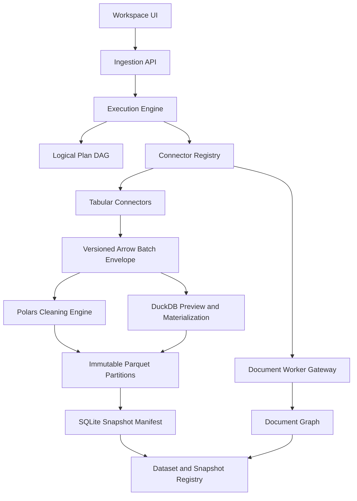

# Data Ingestion Architecture

> Status: Accepted
> Scope: Backend and data contracts only
> Last updated: 2026-08-07

## 1. Decision summary

DataCleaner OS will use a layered Rust ingestion system rather than a single universal connector framework.

The Phase 1 stack is:

| Layer | Primary technology | Responsibility |
| --- | --- | --- |
| Logical contracts | Rust domain types | Stable LogicalSchema, typed expressions/rules, validated plan DAGs and deterministic fingerprints |
| Tabular file IO and cleaning | Polars | CSV, TSV, JSON, NDJSON, Parquet, schema inference, projection, filtering, cleaning expressions |
| Workbook ingestion | Calamine | XLS, XLSX, XLSM, XLSB and ODS workbook discovery and cell extraction |
| Object storage | object_store | Local files, S3-compatible storage, Azure Blob and GCS through one storage abstraction |
| Database control plane | SQLx | Connection tests, catalog discovery, schema inspection, preview queries and incremental cursors |
| Preview and federation | DuckDB | Sampling, preview SQL, file joins, local materialization and CSV-to-Parquet conversion |
| Interchange protocol | Apache Arrow 59 | Versioned bounded batch payload between connectors and engines |
| Metadata persistence | SQLite | Transactional objects, jobs, lineage, events and snapshot manifests |
| Snapshot persistence | Parquet | Immutable, checksummed columnar partitions |

Document ingestion is a separate protocol. Docling will run as an isolated worker in Phase 2. ConnectorX and Airbyte are deferred until measured demand justifies them.

## 2. Product constraints

This architecture preserves the core DataCleaner OS rules:

- The engine processes data deterministically; AI interprets metadata, profiles and results.
- AI must not become the execution path for large-file ingestion or cleaning.
- A Session remains the root runtime object.
- Every imported source becomes an inspectable Object with Context, Relationships and Events.
- The backend must not force document assets into a tabular DataFrame.
- Phase 1 must not modify the existing Workspace layout, components, CSS or design tokens.
- The existing frontend DuckDB WASM integration is a client-side capability, not the authoritative backend execution engine.

## 3. Goals

- Provide one connector contract for discovery, inspection, preview, streaming reads and checkpoints.
- Support professional ingestion of local tabular files, Excel workbooks, object storage and common SQL databases.
- Keep memory bounded by streaming Arrow RecordBatches instead of materializing every source in memory.
- Push projection, predicates, ranges and limits toward the source whenever supported.
- Register imported data as Dataset and Snapshot objects with auditable events.
- Make failures typed, recoverable and visible without leaking credentials.
- Keep future document and SaaS connectors outside the core runtime boundary.

## 4. Non-goals

- Building every SaaS connector in the Rust core.
- Replacing Airbyte as a synchronization platform.
- Embedding Python document models into the Rust process through FFI.
- Treating DuckDB and Polars as interchangeable execution engines.
- Promising change-data-capture support in the first milestone.
- Introducing new frontend navigation, panels or visual systems.

## 5. High-level architecture



The control plane owns connection configuration, metadata, jobs and events. The data plane owns bounded streaming reads, sampling, transformation and materialization.

Logical contracts are independent of both planes. `stillflow-core` owns stable
domain identities, logical schemas and typed expressions; `stillflow-plan` owns
rules, validated DAGs and canonicalization. See
[`ADR-001`](architecture/adr-001-logical-physical-and-storage-boundaries.md).

## 6. Component boundaries

### 6.1 Polars

Polars owns:

- CSV, TSV, JSON, NDJSON and Parquet decoding.
- Lazy scans when the source supports them.
- Schema inference and normalization.
- Cleaning rules and column expressions.
- Projection and predicate pushdown where available.
- Conversion between engine-native values and the Arrow boundary.

Polars does not own connector credentials, source discovery, job state or cross-source SQL federation.

### 6.2 Calamine

Calamine owns workbook decoding. A StillFlow Excel Analyzer wraps it and provides:

- Sheet discovery.
- Header candidate detection.
- Data-region detection.
- Formula presence reporting.
- Merged-cell warnings.
- Hidden row and column warnings when metadata is available.
- Per-sheet preview.

The analyzer must not assume the first row is a header. Ambiguous regions are returned as inspection findings instead of silently coerced.

### 6.3 object_store

object_store is the byte-access abstraction for local and cloud objects. The StillFlow storage adapter exposes:

- list
- head
- get_range
- stream
- upload
- credential reference resolution

Preview code must use range reads where the format permits them. Large remote objects must not be downloaded in full merely to generate a preview.

Phase 1 targets local files and S3-compatible storage first. Azure Blob and GCS use the same interface after the core behavior is validated.

### 6.4 SQLx

SQLx owns the database control plane:

- Connection tests.
- Catalog, schema, table and view discovery.
- Column and key inspection.
- Permission validation.
- Parameterized preview queries.
- Incremental cursor state.

Phase 1 targets PostgreSQL, MySQL/MariaDB and SQLite. SQLx rows must be converted into Arrow batches in bounded chunks; application domain structs are not the bulk-transfer format.

### 6.5 DuckDB

DuckDB owns:

- Preview SQL.
- Sampling.
- Joins across staged sources.
- Local materialization.
- CSV-to-Parquet conversion.
- Source comparison.

DuckDB does not own cleaning-rule semantics. Polars remains the canonical cleaning executor. A conversion boundary must prevent the product from developing two competing rule systems.

### 6.6 Deferred components

- Docling: external Phase 2 worker for PDF, DOCX, PPTX, HTML, OCR and layout-aware parsing.
- ConnectorX: optional Phase 3 bulk database transfer path, introduced only after profiling SQLx ingestion.
- Airbyte: optional Phase 3 SaaS synchronization layer writing into staging storage; it does not own Dataset, Pipeline, Session or Event semantics.

## 7. Internal data protocols

### 7.1 Tabular protocol

```text
Tabular Asset
  -> LogicalSchema
  -> Logical Plan
  -> Stream<BatchEnvelope<Arrow RecordBatch>>
  -> Polars or DuckDB
  -> immutable Parquet partitions
  -> atomic SQLite snapshot manifest
```

Connector boundaries expose stable logical schemas and versioned envelopes around
bounded Arrow batches. They must not expose Polars DataFrames as the public
connector ABI. This limits coupling to Polars internals and keeps DuckDB
integration explicit. The envelope is introduced in its own delivery node; raw
`RecordBatch` streams are a temporary Phase 0 contract until that migration lands.

The workspace lockfile must pin compatible Arrow versions. Any Polars-to-Arrow conversion is isolated in an engine adapter and covered by round-trip tests.

### 7.2 Document protocol

```text
Document Asset
  -> Document Graph
     -> Section
     -> Paragraph
     -> Table
     -> Image
     -> Formula
     -> Metadata
  -> Document Dataset
```

A Document Graph preserves hierarchy, reading order and cross-element relationships. It is not flattened into page/text columns at ingestion time.

## 8. Connector contract

The Phase 0 contract is object-safe and stream-oriented:

```rust
#[async_trait::async_trait]
pub trait SourceConnector: Send + Sync {
    fn kind(&self) -> ConnectorKind;
    fn capabilities(&self) -> ConnectorCapabilities;

    async fn test_connection(
        &self,
        connection: &SourceConnection,
        request: TestConnectionRequest,
    ) -> ConnectorResult<ConnectionStatus>;
    async fn discover(
        &self,
        connection: &SourceConnection,
        request: DiscoverRequest,
    )
        -> ConnectorResult<Vec<SourceAsset>>;
    async fn inspect(
        &self,
        connection: &SourceConnection,
        request: InspectRequest,
    )
        -> ConnectorResult<AssetMetadata>;
    async fn preview(
        &self,
        connection: &SourceConnection,
        request: PreviewRequest,
    )
        -> ConnectorResult<PreviewData>;
    async fn read_batches(
        &self,
        connection: &SourceConnection,
        request: ReadRequest,
    ) -> ConnectorResult<RawBatchStream>;
    async fn checkpoint(
        &self,
        connection: &SourceConnection,
        request: CheckpointRequest,
    )
        -> ConnectorResult<Option<Checkpoint>>;
}
```

The registry attaches request context to `RawBatchStream` and exposes a bounded
asynchronous stream. PR2 replaces the raw Arrow payload with the accepted
versioned `BatchEnvelope` without changing connector responsibilities.

Every connector declares capabilities rather than relying on type checks:

```rust
pub struct ConnectorCapabilities {
    pub schema_discovery: bool,
    pub preview: bool,
    pub streaming: bool,
    pub incremental_read: bool,
    pub predicate_pushdown: bool,
    pub column_projection: bool,
    pub range_read: bool,
    pub change_tracking: bool,
}
```

Requests carry cancellation, deadlines, sampling limits and projection information. Connectors must return UnsupportedCapability when a requested optimization is unavailable.

## 9. Core domain types

| Type | Purpose |
| --- | --- |
| SourceConnection | Configuration plus a reference to credentials; never raw secret values |
| SourceAsset | Discoverable file, sheet, table, view or document |
| LogicalSchema | Stable column identities, logical types, nullability and ordered metadata |
| Expr / Rule | Closed, typed, serializable cleaning intent with no engine objects or SQL fragments |
| LogicalPlan | Validated DAG with deterministic canonical bytes and fingerprint |
| AssetMetadata | Logical schema, size, timestamps, format and inspection findings |
| PreviewRequest | Asset, projection, predicate, row/byte limit and sampling strategy |
| PreviewData | Logical schema, bounded Arrow payloads, truncation state and warnings |
| ReadRequest | Asset, projection, predicate, checkpoint, batch size and deadline |
| BatchEnvelope | Version, logical schema identity, sequence, lineage and bounded Arrow payload |
| Checkpoint | Connector-specific opaque resume token with version metadata |
| DatasetSnapshot | Immutable materialized output plus lineage and quality metadata |

## 10. Object model mapping

| Ingestion concept | DataCleaner OS object | Key relationships/events |
| --- | --- | --- |
| Configured endpoint | SourceConnection | connects_to, tested, failed |
| Discovered file/table/sheet | SourceAsset | contains, discovered, inspected |
| Imported logical data | Dataset | produced_by, imported, profiled |
| Materialized version | Snapshot | snapshot_of, materialized, restored |
| Running ingestion | Session | reads, produces, checkpointed, completed |
| Connector implementation | Capability | creates SourceConnection objects |

Events contain object IDs, timestamps, operation metadata and sanitized errors. They must never contain access keys, passwords, tokens or full connection strings.

## 11. Source-specific behavior

### 11.1 CSV, TSV, JSON and NDJSON

- Detect encoding and delimiter conservatively and expose uncertainty.
- Sample bounded bytes before schema inference.
- Preserve original column names and record normalized aliases separately.
- Report malformed-row policy and counts.
- Allow callers to override inferred types.

### 11.2 Parquet

- Read metadata and footer through range requests where supported.
- Project only requested columns.
- Preserve logical types and nullability.
- Surface row-group statistics used for pruning.

### 11.3 Excel

- Discover all sheets before selecting a data region.
- Return multiple region candidates when confidence is ambiguous.
- Preserve cell provenance using sheet and coordinate metadata.
- Warn about formulas, merged cells and hidden data.

### 11.4 SQL databases

- Use read-only credentials where possible.
- Quote identifiers with the target database dialect.
- Parameterize values; never interpolate user values into preview SQL.
- Apply explicit LIMIT and statement timeout to previews.
- Record the isolation and consistency mode used for snapshots.

## 12. Preview policy

Preview is a bounded diagnostic operation, not a hidden full import.

Defaults are configurable, with these initial product limits:

- Default preview: 1,000 rows.
- Maximum interactive preview: 10,000 rows.
- Column projection is mandatory when the caller selects columns.
- Remote byte reads use ranges when supported.
- Every result reports whether rows or bytes were truncated.
- Cancellation and request deadlines propagate through the connector.
- Full imports run as jobs and emit progress events.

## 13. Failure model

Connector errors use stable categories:

- Authentication
- Authorization
- NotFound
- InvalidConfiguration
- InvalidData
- SchemaDrift
- RateLimited
- Timeout
- Cancelled
- UnsupportedCapability
- TransientSource
- Internal

Errors include a retryability flag, sanitized user message, internal cause chain and source context that contains no secrets.

## 14. Security requirements

- Persist secret references, not plaintext credentials.
- Redact credentials and connection strings from logs and events.
- Enforce allowed local roots and reject path traversal.
- Require TLS by default for remote databases and object storage.
- Use parameterized SQL and read-only preview transactions.
- Apply row, byte, batch, concurrency and timeout limits.
- Audit connection tests, previews, imports and exports.
- Keep temporary materializations inside a managed staging directory.
- Delete temporary data through a defined retention policy.

## 15. Target repository layout

```text
backend/
  Cargo.toml
  crates/
    stillflow-core/
      stable domain IDs, LogicalSchema, Expr, errors, events and object mapping
    stillflow-plan/
      Rule AST, logical plan DAG, validation and deterministic canonicalization
    stillflow-connectors/
      connector trait, capabilities and registry only
    stillflow-connector-local-tabular/
      isolated Polars-backed CSV/TSV/JSON/NDJSON/Parquet adapter
    stillflow-connector-workbook/
      isolated Calamine-backed workbook analyzer and Arrow adapter
    stillflow-engine/
      Arrow adapters, Polars cleaning and DuckDB preview/materialization
    stillflow-storage/
      SQLite metadata, Parquet snapshots, atomic publish and recovery
    stillflow-api/
      HTTP boundary, jobs, cancellation and session integration
  tests/
    fixtures and end-to-end ingestion tests
```

The frontend remains at the repository root during Phase 1. The backend is isolated under backend so the current Vite application can continue to build unchanged.

## 16. API boundary

The first HTTP boundary should expose operations, not connector-specific screens:

| Method | Path | Purpose |
| --- | --- | --- |
| POST | /api/sources/test | Test a connection configuration |
| POST | /api/sources | Register a source connection |
| GET | /api/sources/{id}/assets | Discover source assets |
| POST | /api/assets/{id}/inspect | Inspect schema and format details |
| POST | /api/assets/{id}/preview | Return a bounded preview |
| POST | /api/assets/{id}/imports | Start an import job |
| GET | /api/jobs/{id} | Read progress and terminal result |
| POST | /api/jobs/{id}/cancel | Request cancellation |

API payloads refer to object IDs and credential references. Large RecordBatch streams stay inside the backend or use a dedicated streaming transport; they are not embedded in ordinary JSON responses.

## 17. Delivery phases

### Phase 0 — Foundation

- Create the Rust workspace and CI checks.
- Implement core domain types, error taxonomy and connector registry.
- Freeze logical schemas, typed expressions/rules and validated plan DAGs.
- Migrate raw Arrow streams to a versioned BatchEnvelope boundary.

### Phase 1A — Local tabular files

- CSV, TSV, JSON, NDJSON and Parquet through Polars.
- Excel through Calamine and the Excel Analyzer.
- Bounded preview, schema inspection and Dataset registration.

### Phase 1B — Object storage

- Local and S3-compatible object access through object_store.
- Range-aware Parquet and bounded text sampling.
- Credential references and sanitized events.

### Phase 1C — Databases

- PostgreSQL, MySQL/MariaDB and SQLite control-plane support through SQLx.
- Discovery, inspection, bounded preview and chunked Arrow reads.

### Phase 1D — Preview and materialization

- Native DuckDB preview SQL and local materialization.
- Explicit Polars/DuckDB conversion tests.
- SQLite metadata plus immutable Parquet partitions and atomic manifests.
- End-to-end import, clean, preview and snapshot flow.

### Phase 2 — Document data

- Isolated Docling worker.
- Versioned Document Graph schema.
- Document Dataset registration and RAG-oriented metadata.

### Phase 3 — Enterprise and long-tail sources

- Profile SQLx bulk reads before deciding on ConnectorX.
- Use Airbyte for selected SaaS synchronization into staging storage.
- Add CDC only as a connector-specific capability.

## 18. Phase 1 definition of done

- Local CSV, TSV, JSON, NDJSON, Parquet and Excel fixtures can be discovered,
  inspected, previewed and imported.
- S3-compatible objects can be inspected and previewed without unconditional full download.
- PostgreSQL, MySQL/MariaDB and SQLite can be tested, discovered and previewed using bounded queries.
- Connector output crosses the public boundary as versioned envelopes around
  bounded Arrow 59 RecordBatches.
- Polars cleaning and DuckDB preview produce compatible schemas for supported types.
- Imports register Dataset and Snapshot objects with lineage and sanitized events.
- Cancellation, timeouts and typed failures are covered by tests.
- Credentials are absent from logs, events and persisted domain objects.
- Backend tests and the existing frontend build pass.
- No existing Workspace layout, component styling or design token changes are included.

## 19. Architectural decisions

### Why not one universal library?

No single library provides high-quality file parsing, workbook analysis, cloud object access, database metadata, federation and cleaning. A layered system gives each library a narrow responsibility and keeps replacement possible.

### Why Arrow at the boundary?

Arrow preserves columnar types, supports bounded batches and integrates with both analytical engines. It prevents connector APIs from being coupled to one DataFrame implementation.

### Why both Polars and DuckDB?

Polars is the canonical expression and cleaning engine. DuckDB is the SQL preview, federation and materialization engine. Their responsibilities are deliberately non-overlapping.

### Why SQLite plus Parquet?

SQLite provides transactions and relational integrity for the mutable control
plane. Parquet provides immutable, columnar analytical storage for dataset
snapshots. Atomic manifests connect the two without asking either format to serve
the other's workload.

### Why defer ConnectorX and Airbyte?

ConnectorX adds operational and compatibility cost before a bulk-read bottleneck is measured. Airbyte solves synchronization breadth, not interactive inspection or DataCleaner OS object semantics.

## 20. References

- [Polars IO](https://docs.pola.rs/user-guide/io/)
- [Calamine](https://docs.rs/calamine)
- [Apache Arrow object_store](https://docs.rs/object_store)
- [SQLx](https://github.com/launchbadge/sqlx)
- [DuckDB extensions](https://duckdb.org/docs/stable/core_extensions/overview)
- [ConnectorX](https://github.com/sfu-db/connector-x)
- [Docling](https://github.com/docling-project/docling)
- [Airbyte connectors](https://docs.airbyte.com/integrations/)
