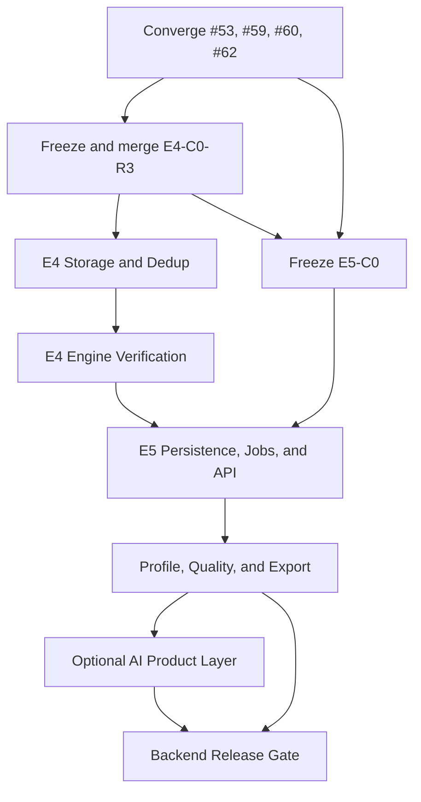

# StillFlow Backend Completion Execution Checklist

> Tracking issue: #63  
> Planning baseline: `main@85502cbebb1fab461fe42d30fe019ad20613aa7c`  
> Current main: `main@473c65b` (PR #62 storage inventory merged)
> Created: 2026-08-18
> Scope: Phase 1 / product-MVP backend completion  
> Status: execution plan; this document does not authorize contract-external runtime work

## 1. Purpose

This document is the repository-owned, dependency-ordered checklist for completing
the StillFlow backend. It converts the high-level Engine roadmap into bounded
contracts, implementation deliveries, acceptance gates, and release criteria.

The product-MVP backend is complete when a caller can execute this deterministic,
auditable lifecycle:

```text
Source registration
  -> discovery / inspection
  -> import
  -> profile and issue detection
  -> LogicalPlan
  -> bounded node Preview
  -> accepted Run
  -> immutable Snapshot
  -> validation / rejected rows / deduplication
  -> Quality and Verification Artifacts
  -> export
```

The optional AI product layer may inspect domain objects and propose typed rule
drafts. It must never own execution, validation, storage, or publication
semantics.

## 2. Completion boundary

### 2.1 Required for the deterministic backend completion gate

- Local CSV, TSV, JSON, NDJSON, and Parquet ingestion.
- Workbook discovery and bounded ingestion.
- Local and S3-compatible object storage with range-aware reads.
- Versioned `BatchEnvelope` connector boundary.
- Deterministic single-source Engine execution.
- Bounded node-level Preview.
- `Validate`, Rejected Rows, and exact `Deduplicate`.
- Immutable Snapshot plus Verification, Quality, and Export Artifacts.
- Persisted Source, Asset, Dataset, Session, Job, Run, Event, and Artifact
  references.
- Bounded job execution, status, cancellation, deadline propagation, restart
  recovery, and idempotency.
- Axum operations for source lifecycle, Preview, Run, Status, Cancel, and
  Artifact reads.
- Deterministic profiling and issue detection.
- CSV, TSV, JSONL, and Parquet export.
- End-to-end, security, recovery, resource-bound, MSRV, and stable acceptance.

### 2.2 Required only for the AI product completion gate

- One provider-neutral AI interface.
- Typed `RuleDraft` generation and validation.
- Inspect, explain, compare, recommend, draft, and orchestrate commands.
- Preview-before-accept and explicit user acceptance before Run.
- Prompt/input/output redaction and audit events.

### 2.3 Explicitly post-MVP

The following do not block either Phase 1 backend gate:

- SQL Connector #9.
- Native DuckDB #10.
- `Join` / `Union` execution.
- Arbitrary Python, SQL, or Polars code.
- Document/Docling processing.
- ConnectorX, Airbyte, CDC, and SaaS synchronization.
- Multi-agent orchestration, a skills marketplace, and remote compute.
- Multi-tenant SaaS, RBAC, SSO, collaboration, or distributed execution.
- PDF, OCR, image, audio, video, and other multimodal ingestion.

## 3. Non-negotiable architecture rules

- Dependency direction remains
  `api -> engine -> {plan, connectors, storage} -> core`.
- Arrow is the public tabular boundary; Polars types remain engine-private.
- Polars is the sole implementation of cleaning-rule semantics.
- AI proposes or explains executable objects; AI never directly mutates a
  DataFrame or defines execution semantics.
- Preview is ephemeral and read-only. It never publishes Snapshot or Artifact
  payloads.
- Final computational outputs are immutable and carry provenance.
- IDs and timestamps used by deterministic execution are caller-injected.
- Credential values are represented by secret references and never appear in
  errors, events, manifests, logs, Debug output, or serialized summaries.
- Every row, byte, memory, time, concurrency, and recovery bound is explicit and
  tested.
- Engine feature branches never include Dependabot changes.
- SQL and DuckDB must not create a second cleaning-rule language.

## 4. Current-state ledger

This table records repository state observed on 2026-08-18. A task must re-check
its base before execution.

| Area | Current item | Head / baseline | State | Required next gate |
| --- | --- | --- | --- | --- |
| Main | `main` | `473c65b` | E2 + storage inventory merged | All new implementation branches start from the latest accepted main |
| E3 | PR #53 / Issue #52 | `51606e48824f725040c61224766bf86238550570` | Draft; E3-R3 pushed; CI passed; final runtime acceptance pending | Approve exact head, Ready, merge, close issue, delete branch |
| E4 | PR #57 / Issue #54 | `cf4f0bdd7207c0a961d05e56ac69bf26578b42da` | Draft; C0-R3 after storage facts merged | Architecture review of R3; do not start runtime |
| E5 inventory | PR #59 / Issue #58 | `6f3ad00b633d8ec96b6a36a2bc6b51bbe99a2331` | Draft; inventory complete | Docs review, Ready, merge, close issue, delete branch |
| Permission smoke test | PR #60 | `07c6384cb91670481aa8cfcfbcac2e189f5fead5` | Closed without merge; branch deleted | None |
| Storage inventory | PR #62 / Issue #61 | `036ec575fc16a240ace77860ebb7389f16dbb3da` | Merged at `main@473c65b`; issue #61 closed; branch deleted | None |
| Plan | Issue #63 | this PR | This docs-only delivery; statuses updated | Merge this checklist after review; it does not unblock runtime by itself |

PR #62 factual approval was bound to
`036ec575fc16a240ace77860ebb7389f16dbb3da`. It validated facts only and did
not approve PR #57 or E4 runtime. PR #62 is now merged at `main@473c65b` and
its facts are incorporated into E4-C0-R3.

## 5. Execution status vocabulary

Each task uses exactly one status:

- `blocked`: an upstream contract, inventory, or runtime has not merged.
- `ready`: all entry conditions are satisfied and no conflicting branch is
  active.
- `in_progress`: one Issue, one branch, and one Draft PR exist.
- `review`: the declared delivery is complete and work has stopped.
- `approved`: an explicit review/comment is bound to the current full head SHA.
- `merged`: the approved head was merged without later commits and the branch
  was deleted.
- `deferred`: explicitly outside the current completion boundary.

A green CI run is evidence, not architecture approval.

## 6. Branch, PR, and review discipline

For every task below:

1. Confirm all dependencies are merged.
2. Fetch the latest accepted `main` and record its full SHA.
3. Create the Issue before naming the branch.
4. Use `agent/issue-NNN-short-description`.
5. Open a Draft PR immediately.
6. Keep one task and one delivery boundary per PR.
7. Never merge, rebase, or cherry-pick an unrelated open feature PR.
8. Do not mix Dependabot updates into product branches.
9. Keep revisions on the existing PR; do not create replacement contract
   branches for R1/R2/R3 reviews.
10. Bind every approval to the exact full head SHA.
11. After approval, add no commit before Ready/Merge.
12. After merge and green CI, close the Issue and delete the remote branch.

No more than three implementation/product branches should be active at once.
Short-lived docs-only architecture or inventory work may temporarily occupy one
additional slot, but must not become a permanent branch.

### 6.1 Local resource policy

For docs-only tasks:

- `git diff --check`;
- confirm exact file scope;
- confirm no `Pending investigation`, `TBD`, or `TODO` when closure requires it.

For Engine runtime tasks, prefer:

```bash
cargo +stable fmt --all -- --check
cargo +stable clippy -p stillflow-engine --all-targets -- -D warnings
cargo +stable test -p stillflow-engine --lib -- --test-threads=1
```

Run workspace-wide tests in CI unless a task explicitly requires a local
workspace run. Preserve `CARGO_BUILD_JOBS=1` or the repository's bounded build
configuration on memory-constrained machines.

## 7. Dependency order



Runtime work never begins from a contract or inventory branch. Every runtime
branch starts from the latest `main` containing the approved contract.

---

## 8. Phase G0 — converge active work

### G0-01 — Remove the permission smoke-test PR

- [x] Status: closed without merge; remote branch deleted.
- **Target:** PR #60 and branch
  `agent/github-permission-test-20260818`.
- **Action:** close without merge; delete the remote branch.
- **Acceptance:** `docs/github-permission-test.md` is absent from `main`.
- **Forbidden:** reusing the branch as a development baseline.

### G0-02 — Finalize E3 node-level Preview

- [ ] Status: `review` at PR #53 head
  `51606e48824f725040c61224766bf86238550570` (E3-R3).
- **Entry:** approved E3-C0 SHA
  `d2809de294bb16ae8fe11f425a4f910ec2ed43cc` remains unchanged.
- **Required evidence:**
  - internal reserve/reallocation segmentation never sets output truncation or
    drops the remainder of the same lowered chunk;
  - exact P05 partition-invariance test exists and executes;
  - exact P06 n-shrink preservation test exists and executes;
  - exact P10 mid-envelope overread test exists and executes;
  - Preview executes zero Snapshot publication entry points through real
    private test counters;
  - P14 proves `n > m > p`, multiple chunks/envelopes, builder/reallocation
    transitions, response caps, live payload count, and 183 MiB peak;
  - sentinel values are absent from Display, Debug, sanitized summaries,
    serialized output, and event metadata;
  - CI passes MSRV 1.85.0, stable, and frontend checks.
- **Exit:** approve exact head, Ready, merge, close #52, delete branch, update
  Epic #3 and roadmap state.
- **Forbidden:** E4/E5 work, dependency updates, public API expansion, new
  Engine error variants, or Snapshot publication in Preview.

### G0-03 — Complete E5-D0 domain inventory

- [x] Status: `review` at PR #59 head
  `6f3ad00b633d8ec96b6a36a2bc6b51bbe99a2331`.
- **Only delivery:** `docs/issues/e5-runtime-domain-inventory.md`.
- **Required inventory:**
  - exact fields, crate ownership, behavior, and persistence state for
    `Session`, `Dataset`, `DatasetSnapshot`, `SnapshotManifest`,
    `IngestionEvent`, `RequestContext`, and `ExecutionIdentities`;
  - `implemented / placeholder / missing / blocked by E4` matrix for `Job`,
    `Run`, generic `Event`, and `Artifact`;
  - existing source/asset/dataset persistence facts;
  - non-binding ownership candidates preserving dependency direction;
  - E5 decision inputs: ID/clock injection, idempotency, state transitions,
    recovery, retention, concurrency, execution limits, event redaction, and
    Artifact references;
  - capability inventory for Preview, Run, Status, Cancel, and Artifact Read,
    without endpoint design.
- **Acceptance:** every factual claim cites a path and base SHA; no pending
  placeholders remain; one changed file; stillflow-api is correctly classified.
- **Exit:** docs review, Ready, merge, close #58, delete branch.
- **Forbidden:** migrations, Rust, HTTP schemas, Axum handlers, public E5
  fields, Agent work, or dependency changes.

### G0-04 — Merge the storage publication/recovery inventory

- [x] Status: `merged` at PR #62 head
  `036ec575fc16a240ace77860ebb7389f16dbb3da`; merged into `main@473c65b`.
- **Verified facts:**
  - publication journal commit precedes staging directory creation;
  - staged and final partition names are distinct;
  - final files precede SQLite snapshot visibility;
  - Snapshot visibility and journal deletion share one SQLite transaction;
  - recovery handles invisible stale publications and orphan staging;
  - maintenance and root-lock scopes are distinct;
  - process-kill and power-loss recovery are not tested;
  - directory durability differs between Unix and non-Unix.
- **Exit:** Ready/merge without new commits, close #61, delete branch.
- **Forbidden:** converting the inventory into a storage contract or changing
  PR #57 from this branch.

### G0-05 — Freeze E4-C0-R3

- [x] Status: `review` at PR #57 head
  `cf4f0bdd7207c0a961d05e56ac69bf26578b42da`; G0-04 is merged.
- **Existing PR:** #57. Continue the same branch and PR.
- **Required R3 closure:**
  - define one crash-safe ownership protocol for dedup `.sqlite` and lock/journal
    resources; recovery must enumerate every partial-creation state;
  - remove contradictions between `artifact_id`, `bundle_id`, manifest identity,
    bundle membership, and provenance;
  - define the exact canonical byte encoding and digest inputs for bundle,
    artifact, section, partition, logical input, and plan identities;
  - define whether report row/byte/partition caps apply per section, artifact,
    or bundle, with equations that compose;
  - replace contradictory preflight/runtime handling of oversized Utf8/Binary
    dedup keys with one executable policy;
  - make acceptance tests use APIs actually authorized by the contract;
  - distinguish “no temporary residue after success” from “recoverable residue
    after crash”;
  - bind bundle publication/recovery to the actual SnapshotStore facts from
    PR #62 without claiming untested durability.
- **Acceptance:** docs-only; unique implementation for every state transition;
  no unresolved identity/cardinality/cap ambiguity; exact failure-injection
  matrix; approved full SHA.
- **Exit:** Ready/merge contract, close contract issue if appropriate, delete
  contract branch.
- **Forbidden:** E4 Rust runtime before approval.

---

## 9. Phase E4 — Verification Layer

### E4-S1 — Artifact and VerificationBundle storage

- [ ] Status: `blocked` on G0-05.
- **Entry:** latest `main` contains approved E4-C0.
- **Primary ownership:** `stillflow-core` for stable domain values;
  `stillflow-storage` for publication, readers, manifests, and recovery.
- **Deliverables:**
  - draft and committed Artifact provenance types;
  - Artifact, section, partition, bundle, and manifest identities;
  - atomic VerificationBundle publication protocol;
  - bounded Artifact and section readers;
  - accepted Snapshot plus optional report artifacts under one visibility
    decision;
  - failure journal, maintenance recovery, orphan cleanup, and fail-closed
    loading;
  - content digests computed by the writer from canonical bytes;
  - migration/version handling and read-time bound revalidation.
- **Acceptance:**
  - write -> load -> bounded-read round-trip;
  - no reader observes a partial bundle;
  - zero rejected rows does not create an empty RejectedRows DatasetSnapshot;
  - crash injection at every contract-defined filesystem/SQLite boundary;
  - cross-platform behavior is documented and tested where support is claimed;
  - no secret-bearing data enters manifests or errors.
- **Forbidden:** validation semantics, Axum, Job Runtime, AI, or dependencies
  beyond the approved contract.

### E4-S2 — Exact deduplication index

- [ ] Status: `blocked` on E4-S1 interface availability.
- **Deliverables:**
  - canonical typed key encoder, including null, signed zero/NaN policy,
    timestamp unit/timezone presence, and supported scalar types;
  - typed `insert_first` result carrying first source-row ordinal;
  - exclusive creation/ownership lease;
  - reserve-before-allocate and SQLite page/byte bounds;
  - secure directory/file permissions;
  - close/delete result that cannot silently discard cleanup failure;
  - deterministic recovery of every partial temp-index state.
- **Acceptance:**
  - partition/batch-size invariant results;
  - multi-column and null key coverage;
  - oversized key handling follows the frozen policy;
  - stale ownership, partial creation, disk-full, cancellation, and cleanup
    failure tests;
  - no dedup key or source cell leaks through errors/events.
- **Forbidden:** approximate dedup, hash-only equality, List/Struct transforming,
  or Timestamp Second if still paused by E2/E4 contracts.

### E4-R1 — Engine validation, rejected rows, and deduplication

- [ ] Status: `blocked` on E4-S1 and E4-S2.
- **Primary ownership:** `stillflow-engine`; reuse E2 typing, lowering, chunking,
  memory tracking, cancellation, sanitized errors, and run gate.
- **Deliverables:**
  - `Rule::Validate` execution;
  - exact `Rule::Deduplicate` execution;
  - accepted-row stream and terminal rejected-row stream;
  - one original source-row payload for each terminal rejection;
  - validation, dedup, and rejection summaries;
  - logical source-row ordinal assigned after Scan output semantics;
  - RuleRef, node, reason, category, source, and run provenance;
  - atomic VerificationBundle commit/abort.
- **Acceptance:**
  - warnings never become rejected rows;
  - one terminal rejection creates at most one rejected payload;
  - no partial bundle on cancellation, timeout, validation failure, storage
    failure, or dedup cleanup failure;
  - deterministic results across connector partitionings and batch sizes;
  - bounded memory, report rows, bytes, partitions, and operator state;
  - sentinel absent from every public/sanitized surface;
  - E2 and E3 tests remain green.
- **Forbidden:** second typing/lowering implementation, Join/Union, arbitrary
  expressions, API, frontend, profiling, or AI.

### E4-G1 — Verification merge gate

- [ ] Status: `blocked` on E4-R1 review.
- **Required evidence:** contract criterion -> exact automated test mapping;
  storage failure injection; Engine memory evidence; cancellation/deadline;
  atomic visibility; reader round-trip; recovery; MSRV/stable CI.
- **Exit:** merge approved runtime heads, close E4 runtime issues, delete
  branches, and update Epic #3.
- **No quantity-only claims:** “N tests passed” never replaces criterion-level
  evidence.

---

## 10. Phase E5 — Runtime domain, jobs, and Axum API

### E5-C0 — Freeze the runtime domain before endpoints

- [ ] Status: `blocked` on approved E4-C0; G0-03 inventory is complete. Use
  merged E4 runtime fields when available.
- **Docs-only decisions:**
  - `Session -> Job -> Run -> Event -> Artifact` ownership and cardinality;
  - SourceConnection, SourceAsset, Dataset, Snapshot, and VerificationBundle
    references;
  - lifecycle states and valid transitions;
  - terminal-state immutability;
  - caller-injected IDs and clock;
  - idempotency-key scope and replay result;
  - event sequence/order, redaction, and retention;
  - queue/run concurrency, deadlines, and cancellation semantics;
  - process restart and orphan Running/Cancelling recovery;
  - Artifact ownership, retention, and bounded-read handles;
  - Preview provenance without Preview payload persistence.
- **Second step only:** after the domain model is internally consistent, freeze
  API operations and public error/response envelopes.
- **Acceptance:** transition table is total; every failure/restart state has one
  result; no endpoint is the source of domain semantics.
- **Forbidden:** runtime implementation before approved SHA.

### E5-S1 — Control-plane persistence

- [ ] Status: `blocked` on E5-C0.
- **Deliverables:**
  - versioned SQLite migrations;
  - repositories for SourceConnection references, SourceAsset, Dataset,
    Session, Job, Run, Event, and ArtifactRef;
  - foreign keys and uniqueness/idempotency constraints;
  - transaction boundaries for state transition plus event append;
  - bounded pagination and lookup indexes;
  - secret-reference-only persistence;
  - migration upgrade, idempotency, future-version fail-closed, and recovery
    tests.
- **Acceptance:** persistence round-trips all frozen objects; no serialization
  support is misreported as persistence; restart retains authoritative state.
- **Forbidden:** plaintext credentials, Engine semantics in repositories, API
  handlers, or unbounded list queries.

### E5-J1 — Job Runtime

- [ ] Status: `blocked` on E5-S1 and E4-G1.
- **Deliverables:**
  - bounded in-process queue;
  - `Queued -> Running -> Cancelling -> Succeeded/Failed/Cancelled` transitions;
  - idempotent submission;
  - RequestContext cancellation/deadline propagation;
  - progress and terminal events;
  - shared Engine concurrency gate integration without hidden unbounded queues;
  - restart reconciliation for Queued, Running, and Cancelling jobs;
  - ArtifactRef publication only after underlying atomic commit.
- **Acceptance:** cancellation races, duplicate submission, process restart,
  worker panic, Engine Busy, connector timeout, and storage failure have exact
  terminal states and sanitized events.
- **Forbidden:** distributed queue, background tasks without ownership, direct
  frontend state, or AI decisions.

### E5-A1 — Axum boundary

- [ ] Status: `blocked` on E5-J1.
- **Required capabilities:**
  - test and register source connection;
  - discover source assets;
  - inspect schema/format;
  - connector asset Preview;
  - Engine node Preview;
  - submit import/materialize/verification Run;
  - read Job/Run status and events;
  - request cancellation;
  - read Artifact metadata and bounded Artifact content.
- **Requirements:**
  - stable versioned request/response and sanitized error envelope;
  - request body, response body, row, byte, timeout, and concurrency limits;
  - idempotency keys on mutation endpoints;
  - no large Arrow payload embedded in ordinary JSON;
  - graceful shutdown and cancellation;
  - OpenAPI generated or validated from the authoritative schemas.
- **Forbidden:** connector-specific business logic in handlers, raw internal
  errors, plaintext credentials, or synchronous unbounded import requests.

### E5-G1 — End-to-end runtime gate

- [ ] Status: `blocked` on E5-A1.
- **Required scenarios:** CSV, NDJSON, Parquet, Workbook, and S3-compatible
  source; Preview; materialize; verification; status; cancel; restart;
  Artifact read.
- **Acceptance:** event order, state, lineage, IDs, timestamps, digests, and
  visible Artifacts agree after restart; MSRV/stable/frontend CI passes.
- **Exit:** close #11 only when all Phase 1 operations are real, not
  placeholders.

---

## 11. Phase Q — deterministic profiling and quality

### Q-C0 — Freeze profiling and finding semantics

- [ ] Status: `blocked` until E5 Artifact/Run ownership is stable.
- **Decisions:**
  - exact versus sampled metrics and deterministic sampling seed/source;
  - ProfileRequest bounds and supported logical types;
  - row/column/null/unique/duplicate metrics;
  - numeric min/max/mean/distribution policy;
  - top values/cardinality policy;
  - Utf8/Binary length and invalid-value policy;
  - schema, text, duplicate, privacy, distribution, and leakage finding
    categories;
  - Quality score formula, missing-evidence behavior, and version;
  - Profile/Quality Artifact provenance and canonical digest.
- **Forbidden:** LLM-defined metrics, opaque scores, or unbounded exact
  cardinality.

### Q-R1 — Bounded streaming profiler

- [ ] Status: `blocked` on Q-C0.
- **Deliverables:** deterministic column accumulators, bounded state, sampling,
  supported-type metrics, Profile Artifact writer, cancellation/deadline.
- **Acceptance:** batch/partition invariance, memory bounds, empty/all-null/wide
  schema, maximum cardinality, long strings, and sentinel tests.

### Q-R2 — Deterministic issue detection and QualityReport

- [ ] Status: `blocked` on Q-R1 and E4-G1.
- **Deliverables:** versioned deterministic detectors, typed findings,
  QualityReport Artifact, Quality score, links to validation/dedup summaries.
- **Acceptance:** every finding cites evidence and object/rule/node provenance;
  no AI-generated finding is presented as deterministic evidence.

### Q-A1 — Profiling/quality Job and API integration

- [ ] Status: `blocked` on Q-R2 and E5-A1.
- **Acceptance:** submit, status, cancel, restart, Artifact read, pagination, and
  error redaction follow E5 semantics without a second job system.

---

## 12. Phase X — export

### X-C0 — Freeze export semantics

- [ ] Status: `blocked` until Artifact and Dataset ownership are stable.
- **Decisions:**
  - only committed immutable Snapshot/Artifact inputs;
  - CSV, TSV, JSONL, and Parquet schema/null/timezone/escaping semantics;
  - deterministic column and row ordering;
  - Instruction/Chat JSONL only if a separate typed schema is approved;
  - output rows, bytes, partitions, time, and temporary-storage bounds;
  - filename safety, allowed roots, digest, provenance, retention, and
    overwrite policy;
  - atomic publication and recovery.
- **Forbidden:** exporting Preview payload as a final Artifact or silently
  overwriting an existing Artifact.

### X-R1 — Export runtime and ExportArtifact

- [ ] Status: `blocked` on X-C0.
- **Deliverables:** streaming encoders, safe staging, atomic move/publish,
  cancellation, restart recovery, writer-computed digest, ExportArtifact.
- **Acceptance:** round-trip fixtures, deterministic bytes where promised,
  corrupt input, disk-full, cancellation, path traversal, and no-partial-output
  tests.

### X-A1 — Export Job and API

- [ ] Status: `blocked` on X-R1 and E5-A1.
- **Deliverables:** submit/status/cancel, Artifact metadata, bounded download or
  stream handle, retention/delete operation if frozen.
- **Acceptance:** reuses E5 job/event/error/idempotency semantics.

---

## 13. Phase AI — optional product AI layer

This phase starts only after deterministic Preview, Run, Verification, Profile,
Quality, and Export objects exist.

### AI-C0 — Freeze Agent authority and command model

- [ ] Status: `blocked` on Q and X completion.
- **Allowed commands:** inspect, explain, compare, recommend, draft, and
  orchestrate.
- **Forbidden authority:** direct DataFrame mutation; arbitrary code; execution,
  validation, storage, quality-score, or publication semantics.
- **Required flow:** intent -> typed RuleDraft -> AST validation -> Preview ->
  explicit acceptance -> Run.
- **Decisions:** provider interface, model/version recording, prompt/event
  redaction, user acceptance record, retries, cost/token bounds, and offline
  failure behavior.

### AI-R1 — Provider-neutral RuleDraft service

- [ ] Status: `blocked` on AI-C0.
- **Deliverables:** provider adapter, secret references, structured schema,
  RuleDraft parser, closed AST validation, plan compiler, draft provenance,
  Preview request generation.
- **Acceptance:** malformed output, prompt injection, secret/sentinel, unknown
  rule, unsupported type, timeout, retry, and deterministic-core isolation.

### AI-A1 — Workspace assistant operations

- [ ] Status: `blocked` on AI-R1.
- **Deliverables:** object-aware inspect/explain/compare/recommend/draft APIs;
  Session/Run/Event linkage; explicit acceptance endpoint/command.
- **Acceptance:** every proposed change resolves to inspectable domain objects;
  no chat message can bypass preflight or publication gates.

---

## 14. Phase H — release hardening

### H1 — Golden end-to-end matrix

- [ ] Import -> Profile -> Detect -> Plan -> Preview -> Run -> Validate ->
  Export succeeds for required local formats.
- [ ] Workbook covers sheet/region/provenance behavior.
- [ ] S3-compatible fixture proves bounded/range-aware reads.
- [ ] Repartitioned connector streams produce identical logical results.
- [ ] Empty, all-null, wide, long-string, malformed, and schema-drift fixtures
  are covered.
- [ ] Every acceptance criterion maps to exact test names and CI runs.

### H2 — Security, failure, and recovery matrix

- [ ] Credentials and sentinel cell values are absent from all public/error/log/
  event/serde/Debug surfaces.
- [ ] Local roots reject traversal, symlink escape, and unsafe overwrite.
- [ ] Corrupt Arrow/Parquet/Workbook/object data fails closed.
- [ ] Row, byte, memory, operator-state, time, queue, reader, publisher, and
  request limits are enforced before unsafe allocation/work.
- [ ] Cancellation and deadline checks cover before read, pending read, lowering,
  append, pre-commit, and API response.
- [ ] Snapshot, Verification, Job, and Export crash/restart states are tested in
  fresh process/store scenarios where durability is claimed.
- [ ] Unix and Windows differences are either tested or explicitly excluded.

### H3 — Operations and release gate

- [ ] SQLite migration upgrade and future-version fail-closed tests pass.
- [ ] Backup/restore and managed-root recovery procedure is documented.
- [ ] Configuration, secret references, storage roots, resource limits, and
  graceful shutdown are documented.
- [ ] OpenAPI and error taxonomy are current.
- [ ] Rust 1.85.0, stable, formatting, clippy, workspace tests, and frontend
  build pass in CI.
- [ ] No product TODO, placeholder endpoint, empty implementation crate, or
  unreviewed unsafe block remains.
- [ ] Dependabot is handled in isolated PRs after feature freeze; the grouped
  Polars 0.46 -> 0.55 update is never merged as incidental cleanup.
- [ ] All merged delivery branches are deleted and Epic #3 is current.

## 15. Final definitions of done

### 15.1 Deterministic backend complete

All G0, E4, E5, Q, X, and H checkboxes are complete. One caller can:

1. register a source reference;
2. discover and inspect an asset;
3. import bounded batches;
4. profile and obtain deterministic findings;
5. create a typed LogicalPlan;
6. Preview any supported node;
7. submit, observe, cancel, and recover a Run;
8. materialize an immutable Snapshot;
9. read Validation, RejectedRows, Deduplication, and Quality Artifacts;
10. export a committed result;
11. restart the backend and still explain authoritative Job, Run, Event,
    Artifact, lineage, digest, and terminal-state facts.

### 15.2 AI product backend complete

The deterministic backend is complete and all AI tasks are complete. The AI can
only produce inspectable drafts and commands, and every accepted transformation
still executes through the same deterministic contracts.

## 16. Plan maintenance

- Update status only in the PR that actually changes the underlying state or in
  a dedicated short-lived roadmap PR.
- Record full merged SHAs, not seven-character claims, at approval and merge
  gates.
- Do not mark a phase complete from test counts alone.
- If implementation needs a new public field, dependency, error category,
  resource model, or publication state not authorized by the frozen contract,
  stop and return to a docs-only contract revision.
- New post-MVP ideas belong in separate Issues and must not silently enlarge the
  Phase 1 completion gate.

## 17. Immediate execution queue

Execute only the first unblocked item in each independent lane:

1. close PR #60 without merge;
2. finish CI and final acceptance review for PR #53 at `bdcfd64…`;
3. Ready/merge PR #62 at approved `036ec575…`;
4. complete PR #59 inventory;
5. revise PR #57 to E4-C0-R3 after PR #62 is merged;
6. do not create any E4 runtime branch before step 5 is approved and merged.
