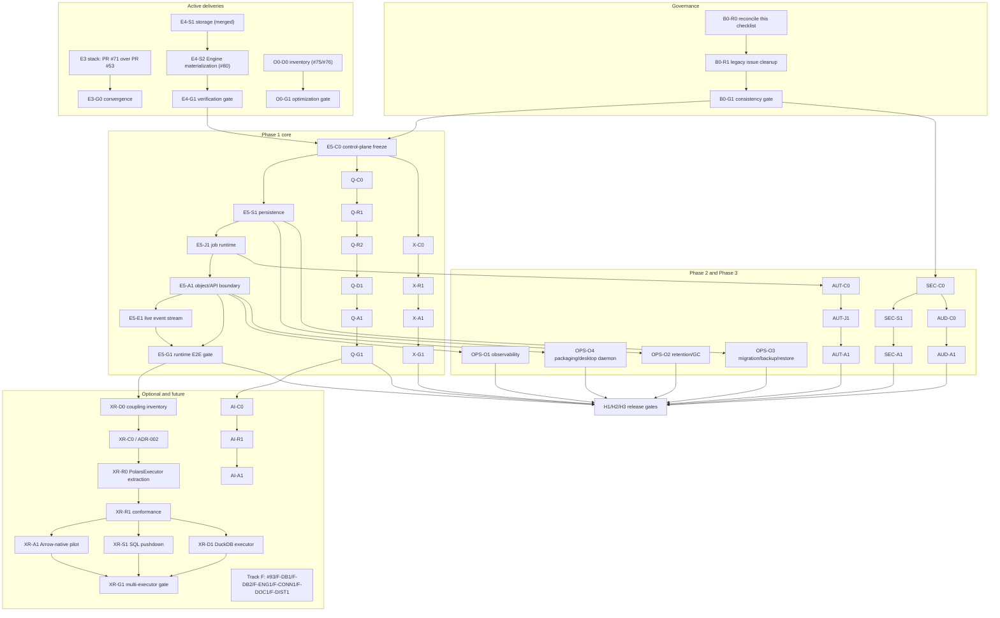

# StillFlow Backend Completion Execution Checklist

- Canonical roadmap: Epic #81 (roadmap/dependencies only; not a live execution-state mirror)
- Original reconciliation: Issue #82 (B0-R0), branch
  `agent/issue-082-backend-roadmap-reconciliation` (historical snapshot)
- Client roadmap: [X44421/openship#1](https://github.com/X44421/openship/issues/1)
- Live implementation state is read from GitHub at execution time. Any SHA in
  this document is a historical planning/evidence anchor unless explicitly
  labeled as a frozen contract base.
- Latest state refresh: 2026-08-31 UTC, re-read from GitHub after the
  exact-head merges:
  - PR #179 / Q-R1: accepted head `3b305b3c9204c55a30344e80c6672f9c688948bc`,
    merge commit `4d399f621ff0ed071c68e180fc0cba4e8df7665b`.
  - PR #182 / Q-R2: accepted head `e557d5f1540ce356101a2b276b30f25b261ca4b6`,
    merge commit `9c039752d5f98584573e623ff3a986be8525383b`.
  - PR #185 / X-R1: accepted head `3555ac7ec4a7a80bd2093559b2ed4215fa69faf4`,
    merge commit `6d29948a948e8921677d0f14bc86d2d40007e25c`.
  - PR #186 / E24 productionization: accepted head
    `2e74f58d5fcd8939328d62e5b87fdb78bbee779e`, merge commit
    `6dcec4fa35d3c46abe3c0c4abe8138263493d27c`.
  - Issues #184 and #158 are `CLOSED / completed`; #151 remains `OPEN` and
    authoritative for the retained Polars timestamp boundary.
  - No current writer from this delivery round is assigned to `engine`,
    `storage`, `core`, `connector`, or `merge:main`; coordination registry
    freshness and historical lock rows must be checked separately.
- Next mainline after X-R1: E5-C0 unified control-plane contract; Golden E2E
  remains downstream of the Runtime/Job/API control-plane prerequisites.
- Historical baselines (superseded; never cite as current): planning base
  `main@85502cbebb1fab461fe42d30fe019ad20613aa7c`; previous ledger baseline
  `main@473c65b`
- Created: 2026-08-18 — Reconciled: 2026-08-22 by B0-R0
- Scope: Phase 1 deterministic MVP; Phase 2 client-ready product backend;
  Phase 3 production backend; optional AI product layer; registered future
  capabilities
- Status: dependency/completion plan bound to Epic #81. This document does not
  mirror per-task head, CI, lock, or review state. Execution uses the repository
  risk routing: L0/L1 use GitHub only; L2/L3 add scoped coordination claims and
  exact-head independent acceptance through a native PR Review or compliant
  acceptance receipt.

## 1. Purpose

This document is the repository-owned, dependency-ordered checklist for
completing the StillFlow backend. It defines completion boundaries and records
historical planning decisions. It is **not** a second live task database.
GitHub Issues/PRs own live task and implementation facts; the coordination
registry owns active L2/L3 writer locks only.

The Phase 1 backend is complete when a caller can execute this deterministic,
auditable lifecycle:

```text
Source registration
  -> discovery / inspection
  -> import
  -> Dataset and immutable Snapshot
  -> LogicalPlan
  -> bounded node Preview
  -> accepted Run
  -> Validate / exact Deduplicate
  -> VerificationBundle
  -> Profile, Quality findings
  -> export
```

Phase 2 extends this lifecycle with persisted Plans and versions, complete
object APIs, a live event stream, workspace identity and authorization,
automations, profile history and drift, and protocol equivalence between the
web remote service and the Desktop local service.

Phase 3 adds production readiness: version negotiation with generated clients,
observability, retention/GC, migration/backup/restore, security hardening,
cross-platform evidence, and release/upgrade/rollback capability.

The optional AI product layer may inspect domain objects and propose typed rule
drafts. It must never own execution, validation, storage, or publication
semantics.

## 2. Completion boundary

### 2.1 Phase 1 gate — deterministic backend MVP

- Local CSV, TSV, JSON, NDJSON, and Parquet ingestion.
- Workbook discovery and bounded ingestion.
- Local and S3-compatible object storage with range-aware reads.
- Versioned `BatchEnvelope` connector boundary.
- Deterministic single-source Engine execution.
- Bounded node-level Preview.
- `Validate`, Rejected Rows, and exact `Deduplicate`.
- Immutable Snapshot plus Verification, Quality, and Export Artifacts.
- Persisted Source, Asset, Dataset, Session, Job, Run, Event, and Artifact
  references.
- Bounded job execution, status, cancellation, deadline propagation, restart
  recovery, and idempotency.
- Axum operations for source lifecycle, Preview, Run, Status, Cancel, and
  Artifact reads.
- Deterministic profiling and issue detection.
- CSV, TSV, JSONL, and Parquet export.
- End-to-end, security, recovery, resource-bound, MSRV, and stable acceptance.

### 2.2 Phase 2 gate — client-ready product backend

Required so Openship Web/Desktop/CLI ([openship#1](https://github.com/X44421/openship/issues/1))
can be a thin client of this backend:

- Plan persistence: save, version, clone, conflict handling, and authoritative
  validation backed by the canonical plan digest.
- Complete object APIs for Dataset, Session, Plan, PlanVersion, Run, Event,
  and Artifact (list/read/create/update/archive semantics per object).
- Live Event Stream with cursor, resume, replay, deduplication, ordering, and
  backpressure contracts.
- Workspace, member, role/capability, credential-reference, and audit
  foundations.
- Automations: triggers, schedules, run templates, retry/failure policies.
- Profile history and drift comparison against retained baselines.
- Protocol equivalence between the Web remote transport and the Desktop local
  service transport.

### 2.3 Phase 3 gate — production backend

- Schema/version handshake, compatibility matrix, and generated or mechanically
  validated TypeScript/CLI contracts with a drift gate.
- Health/readiness/liveness, metrics, tracing, and structured logs.
- Migration strategy, backup consistency points, restore, version rollback,
  retention policies, and reference-safe GC.
- Security hardening, failure injection, and Unix/Windows/macOS coverage.
- Release, upgrade, and rollback delivery capability.

### 2.4 Optional AI product completion gate

- One provider-neutral AI interface.
- Typed `RuleDraft` generation and validation.
- Inspect, explain, compare, recommend, draft, and orchestrate commands.
- Preview-before-accept and explicit user acceptance before Run.
- Prompt/input/output redaction and audit events.

### 2.5 Registered future capabilities

Track F registers the deterministic Runtime/Physical Executor program (#93),
SQL Connector (#9), native DuckDB (#10), Join/Union,
SaaS/CDC/Airbyte/ConnectorX connectors, document/multimodal processing, and
remote/distributed execution. None of them blocks any Phase 1, Phase 2, or
Phase 3 gate. The #93 program is the architecture prerequisite for future
automatic backend selection, SQL/DuckDB physical pushdown, Arrow-native
kernels, GPU, and remote executors; registration alone authorizes no runtime
change. See section 20.

## 3. Non-negotiable architecture rules

- Dependency direction remains
  `api -> engine -> {plan, connectors, storage} -> core`.
- The Rust backend is the sole authority for execution, validation, digests,
  identity, Artifact state, and persistence. The API surface, Desktop app, CLI,
  and TypeScript code must never implement a second executor or duplicate any
  canonical algorithm.
- Arrow is the public bounded tabular interchange protocol; Polars types,
  DuckDB handles, SQL strings, raw Arrow buffers, and future physical-plan
  objects remain outside stable logical/domain APIs.
- Until XR-C0/ADR-002 is accepted, Polars remains the sole implementation of
  cleaning-rule semantics and the Phase 1 canonical executor. Registering #93
  does not weaken this current rule.
- The long-term #93 direction is a deterministic Runtime over stable
  LogicalPlan semantics with private, capability-matched physical executors.
  A backend decides how an authorized fragment executes; it never redefines
  what a rule means.
- Runtime authority retains cancellation, deadlines, resource/concurrency
  bounds, execution identity, verification, recovery, and atomic
  Artifact/Snapshot publication across every future executor.
- Backend selection and fallback must be deterministic, provenance-bearing,
  and gated by declared equivalence evidence. SQL/DuckDB pushdown may execute
  only semantically proven fragments.
- Arrow itself is not a backend; an Arrow-native kernel executor may become
  one behind the same physical-execution contract.
- AI proposes or explains executable objects; AI never directly mutates a
  DataFrame or defines deterministic bulk-cleaning semantics. Embedding,
  document, or model operations use typed worker/effect contracts with
  explicit provenance rather than impersonating a deterministic backend.
- Preview is ephemeral and read-only. It never publishes Snapshot or Artifact
  payloads, and only provenance records about Preview may persist.
- Final computational outputs are immutable and carry provenance.
- IDs, timestamps, retry inputs, and test clocks are caller-injected on
  deterministic paths; those paths never read randomness or wall clocks.
- Every row, byte, memory, time, concurrency, queue, reader, writer, and
  recovery bound is explicit and tested, and enforced before unsafe allocation
  or work.
- Credential values are represented by secret references (`CredentialRef`) and
  never appear in errors, events, manifests, logs, Debug output, panics, or
  serialized summaries.
- All state changes go through a dedicated Issue, branch, and Draft PR; direct
  writes to `main` are forbidden.
- Bulk deletions, renames, or protocol replacements execute in slices only
  after their replacement path has been accepted.
- A green CI run is evidence, not contract or architecture approval.
- Engine feature branches never include Dependabot changes.
- SQL and DuckDB must not create a second cleaning-rule language.

## 4. Current-state ledger

Facts below were re-read from GitHub at B0-R0 claim time, 2026-08-22
(09:24-09:40 UTC window). Every task must re-check its base before execution;
these SHAs describe the moment of reconciliation, not a permanent baseline.

| Area | Item | Head / merge SHA | State | Next gate |
| --- | --- | --- | --- | --- |
| Main | `main` | `f16666e59896e2d8bae3b79e188b8f567bb8c534` | PR #74 (E4-S1) merged 2026-08-22T08:32Z | All new branches start here |
| Governance | Epic #81 / Issue #82 | this delivery | B0-R0 in progress (this Draft PR) | Review, merge; then B0-R1 |
| E3 runtime | PR #53 / Issue #52 | head `c50e3c937b3494f56ed6cda19c47a83aff36de93`, base `main` | Draft; open | E3-G0 stacked convergence |
| E3 memory law | PR #71 / Issue #70 | head `2b9fdcb716a66a0ff92cedd82825f533c16b6250`, base PR #53 branch | Draft; stacked above #53; must not merge independently to main | E3-G0 |
| E4 contract | C0-R6 via PR #77 + completion PR #78 | `679cab637e7b1764f0333133a86ffeddc775c397` / `9891dcf55875bb5e236e3573d17e50fae9caa091` | Merged 2026-08-22; Issue #54 closed; R6 frozen at the exact base | Authoritative for E4-S2 |
| E4-S1 storage | PR #74 / Issue #73 | accepted head `9707ce990b0abeb3150b241a6b51ce0317d78e7f`; merge commit `f16666e…` | Merged; storage, readers, publication/recovery, and DedupIndex delivered | Residual Issue #73 closure hygiene assigned to B0-R1 |
| E4-S2 engine | Issue #80 | branch `agent/issue-080-e4-verification-materialization` from `f16666e…`; no Draft PR at reconciliation time | Dispatched and CLAIMed; Engine materialization in progress; owned exclusively by #80 | E4-G1 after independent acceptance |
| E5 inventory | PR #59 / Issue #58 | `dec968cf7cfac3183874cd57be48b8418125eef1` | Merged 2026-08-18T11:41Z; Issue #58 closed | Inputs consumed by E5-C0 |
| Legacy E4-C0 R5 | PR #57 | `d77e9392d7ac3cbe63fd55bfcb2056cfd921d9f0` | Historical: merged 2026-08-21T07:44Z, superseded by C0-R6 | None |
| Performance facts | Issue #75 / PR #76 | head `ceeaa1e113ce335a804c016dd9404c4937a01105`, base `main` | O0-D0 inventory Draft open | Fact acceptance, then O0-G1 |
| Legacy G0 lane | PR #60 closed without merge; PR #62 merged at historical `473c65b` | — | Historical: resolved before this baseline | None |
| Old checklist tracking | Issue #63 | — | Historical: closed | Superseded by Epic #81 |

Historical notes (superseded states, kept for traceability):

- The former Phase G0 tasks G0-01..G0-05 are resolved: #60 closed without
  merge; #59/#62 inventories merged; the E4 contract converged through
  C0-R5 (#57) into frozen C0-R6 (#77/#78); E3 finalization moved into E3-G0.
- The former checklist tracked itself through Issue #63, now closed. Epic #81
  is the single canonical ledger from here on.

### 4.1 Current-state re-read at T89-REBIND-R2 (2026-08-23)

Facts below were re-read from GitHub at the rebind execution window
(2026-08-23 08:32-08:47 UTC). They supersede matching rows of the B0-R0
snapshot above; that snapshot is kept verbatim for traceability.

| Area | Item | Head / merge SHA | State at this re-read | Next gate |
| --- | --- | --- | --- | --- |
| Main | `main` | `c0e828031f0141fa89e6b525b4314ebabd5f4f4e` | Advanced from `f16666e…` via interim `ea54a526…`, then PR #88 (DX-F0) merged 2026-08-23T07:16Z as `9c368ce…` and PR #53 merged 2026-08-23T08:00Z | All new branches start here |
| E3 runtime | PR #53 / Issue #52 | rebind head `a7a517c29a0509716d68a53c0baf0c32b0e483d8`; merge commit `c0e828031f0141fa89e6b525b4314ebabd5f4f4e` | Merged into main 2026-08-23T08:00:28Z after exact-head rebind and independent APPROVE acceptance (PR #53 comment 5384935921); Issue #52 closed | Delivered |
| E3 memory law | PR #71 / Issue #70 | merge commit `90fb878e2ace78a6e1c2698014bca5461f19db59` into the #53 branch | Merged 2026-08-23T06:46:49Z under engine-writer serialization; delivered to main through #53; Issue #70 closed | Delivered |
| Governance | Epic #81 / Issue #82 | this delivery rebased onto `c0e82803…` (rebased head `34800bc…`) | B0-R0 delivered; B0-R1 review PASS (Issue #90 closed); F-XR0/#93 registration carried by this PR | Independent rebind acceptance, then maintainer Ready/merge decision |
| E4-S2 engine | Issue #80 / PR #91 | Draft head `d0ea2a3bce548a6cdc311dea4387e29e35e440ab`, base main | Hold maintained; R0 acceptance REQUEST CHANGES (F1-F4); rebind onto `c0e82803…` blocked by a `stillflow-engine/src/tests.rs` conflict, folded into the conditional R1 scope (REGISTRY-R22/R23) | Reserved-session CLAIM/DONE, then maintainer R1 dispatch |
| Performance facts | Issue #75 / PR #76 | head `ceeaa1e113ce335a804c016dd9404c4937a01105` (unchanged) | Body-only status refresh posted 2026-08-23; CI success on the exact head; still Draft | Independent exact-head acceptance |
| XR track | Issues #93 / #94 | - | #93 registered in this delivery (F-XR0 below); XR-D0 execution-backend coupling inventory dispatched as Issue #94 against `main@c0e82803…` | Inventory fact review, then XR-C0 inputs |

All other rows of the B0-R0 snapshot remain accurate at this re-read.

### 4.2 Current-state re-read after Q-R1, Q-R2, X-R1, and E24 merges (2026-08-31)

The earlier snapshots remain in this document for traceability. The following
is the current dispatch baseline, re-read from GitHub after the exact-head
merges and the post-merge main CI run.

| Area | Item | Accepted head / merge SHA | Current state | Next gate |
| --- | --- | --- | --- | --- |
| Main | `main` | `6dcec4fa35d3c46abe3c0c4abe8138263493d27c` | PR #186 merged; post-merge push CI run `33363994777` is successful | All new branches start here |
| Q-R1 | PR #179 / Issue #178 | accepted `3b305b3c9204c55a30344e80c6672f9c688948bc`; merge `4d399f621ff0ed071c68e180fc0cba4e8df7665b` | Merged; Issue #178 `CLOSED / completed` | Q-R2 completed |
| Q-R2 | PR #182 / Issue #181 | accepted `e557d5f1540ce356101a2b276b30f25b261ca4b6`; merge `9c039752d5f98584573e623ff3a986be8525383b` | Merged; Issue #181 `CLOSED / completed` | Q track remains available for later Drift/API work |
| X-R1 | PR #185 / Issue #184 | accepted `3555ac7ec4a7a80bd2093559b2ed4215fa69faf4`; merge `6d29948a948e8921677d0f14bc86d2d40007e25c` | Merged exact-head; Issue #184 `CLOSED / completed` | X-A1 after the control-plane prerequisites |
| E24 productionization | PR #186 / Issue #158 | accepted `2e74f58d5fcd8939328d62e5b87fdb78bbee779e`; merge `6dcec4fa35d3c46abe3c0c4abe8138263493d27c` | Merged exact-head; Issue #158 `CLOSED / completed`; feature remains private/default-off | Separate enablement only after its temporal boundary is resolved |
| Temporal boundary | Issue #151 | — | `OPEN`; `TIMESTAMP_ROOT_CAUSE_POLARS_UPSTREAM` remains authoritative | No local timestamp compensation |
| Coordination | writers and locks | — | No current writer from this delivery round on `engine`, `storage`, `core`, `connector`, or `merge:main` | Reconcile the coordination registry before a new dispatch |
| Mainline | next functional task | — | E5-C0 unified control-plane contract is next after X-R1; Golden E2E remains downstream | E5-C0 contract freeze |

The remote coordination registry has no `running` or `claimed` task rows in
its latest available snapshot, but that snapshot is stale (`source_main_sha`
`04966586192f8750a02790da988db71a28d82074`, updated 2026-08-29) and retains
historical locks on terminal tasks. Those rows are not active writers, but the
registry must be refreshed before the next implementation dispatch.

## 5. Execution state and authority

This checklist uses roadmap states only: `blocked`, `ready`, `active`,
`delivered`, and `deferred`. It must not duplicate the live PR head, CI,
review, branch-lock, or merge state.

Live authority is:

- GitHub Issue: task scope/lifecycle for L1-L3;
- GitHub PR: implementation head, CI, review and merge state; the accepted
  commit is bound there when native Review is used;
- linked Issue or PR comment: canonical exact-head acceptance receipt when the
  receipt path is used;
- coordination/task-registry: active L2/L3 writer/lock claims only;
- Epic #81: roadmap dependencies/milestones only.

L0 work does not require a task Issue. L1 requires an Issue but no Registry.
Only L2/L3 require a scoped CLAIM/lock. A single-PR independent acceptance is a
GitHub PR Review by a separate reviewer, or a compliant exact-head acceptance
receipt when no separate GitHub reviewer identity is available; it is not a
separate acceptance Issue.

## 6. Branch, PR, review, and rebind discipline

Apply the repository risk level first:

- **L0:** branch -> PR -> relevant CI -> merge. No Issue/Registry.
- **L1:** Issue -> PR -> relevant CI -> normal PR review -> merge.
- **L2:** Issue -> scoped CLAIM/lock -> Draft PR -> exact-head CI ->
  independent PR Review or compliant acceptance receipt -> merge.
- **L3:** frozen contract -> scoped CLAIM/lock -> Draft PR -> exact-head CI ->
  independent PR Review or compliant acceptance receipt -> guarded merge.

General rules:

1. Confirm semantic dependencies, not merely that `main` has a new SHA.
2. L1-L3 use one canonical Issue and `agent/issue-NNN-short-description`.
3. Keep one implementation boundary per PR and revisions on the same PR.
4. Do not create a separate acceptance Issue for a single PR.
5. For L2/L3, the PR Review commit or the commit named in a compliant
   acceptance receipt is the accepted exact head. Before merge, verify the
   current head still equals that commit and required CI is green. A receipt
   must disclose that it is not a native GitHub Review and satisfy the evidence
   requirements in `AGENTS.md`.
6. Main drift triggers rebind only for authorized-path overlap, shared
   dependency/contract changes, merge conflicts, or a changed semantic
   assumption. Unrelated drift does not force rebind/reaccept.
7. Use the narrowest stable Registry lock; crate-wide locks require L3 or an
   explicit reason.
8. Never merge, rebase, or cherry-pick an unrelated open feature PR.
9. Do not mix Dependabot updates into product branches.
10. After merge, close the Issue when applicable and release any active
    Registry claim. GitHub already owns merge/head/CI history; do not duplicate
    it across ledgers solely for bookkeeping.

No more than three implementation/product branches should be active at once.
Short-lived docs-only architecture or inventory work may temporarily occupy one
additional slot, but must not become a permanent branch.

### 6.1 Local resource policy

For docs-only tasks:

- `git diff --check`;
- confirm exact file scope;
- confirm no unresolved markers remain where closure requires it.

For Engine runtime tasks, prefer:

```bash
cargo +stable fmt --all -- --check
cargo +stable clippy -p stillflow-engine --all-targets -- -D warnings
cargo +stable test -p stillflow-engine --lib -- --test-threads=1
```

Run workspace-wide tests in CI unless a task explicitly requires a local
workspace run. Preserve `CARGO_BUILD_JOBS=1` or the repository's bounded build
configuration on memory-constrained machines.

## 7. Dependency order



The graph is acyclic by construction: governance and active deliveries feed
Phase 1 core; Phase 1 core feeds Phase 2/3 tracks; all gates converge on H.
Track F registrations block no Phase 1/2/3 or H gate. Their later
implementations may still have internal dependencies: #93 runtime work follows
E5-G1 and the Phase 1 deterministic backend gate, and SQL/DuckDB physical
execution follows XR-C0 plus XR-R1. Runtime work never begins from a contract
or inventory branch; every runtime branch starts from the latest `main`
containing its approved contract.

## 8. Track B0 — roadmap and governance convergence

### B0-R0 — Rebuild the authoritative backend checklist on current main

- [ ] Status: `review` — canonical Issue #82; this docs-only state refresh is
  based on current `main@6dcec4fa35d3c46abe3c0c4abe8138263493d27c`. The
  historical B0-R0 implementation remains recorded above; this refresh adds
  no product-code changes.
- **Dependencies:** none beyond the exact base.
- **Deliverables:** this document, rewritten to mirror Epic #81: updated
  ledger (#57, #59, #74, #77, #78 merged facts), old E4-S2/E4-R1 topology
  replaced by Issue #80's E4-S2 -> E4-G1 chain, Phase 1/2/3 boundaries, full
  task topology with dependencies/entry/deliverables/acceptance/forbidden/exit
  per task, Track F registration, and historical SHAs labeled historical.
- **Acceptance:** single authorized file changed; `git diff --check` passes;
  no unresolved markers; document state agrees with GitHub facts; dependency
  graph acyclic; #80 not re-defined or re-dispatched; un-dispatched tasks not
  marked `in_progress`.
- **Forbidden:** any Rust/TypeScript/workflow/dependency file; touching
  PR #53/#71/#76/#74 branches, the #80 branch, or `experiment/e4-vertical-slice`;
  closing, merging, Ready-marking, or deleting any existing task.
- **Exit:** review and merge of this PR; DONE recorded on #82.

### B0-R1 — Clean up legacy Epic/Issue state conflicts

- [ ] Status: `blocked` on B0-R0 review (per Epic #81 execution order).
- **Dependencies:** merged B0-R0.
- **Deliverables (governance-only):**
  - align Epic #3 scope with Epic #81 and back-link it;
  - amend Issue #11 so its acceptance no longer treats SQL Connector (#9) and
    native DuckDB (#10) as Phase 1 dependencies: Phase 1 exit covers the
    file/workbook/S3 subset; SQLite/PostgreSQL/MySQL end-to-end evidence moves
    to F-DB1, DuckDB evidence to F-DB2;
  - verify Issue #73 DONE/merge/branch-deletion evidence (acceptance and merge
    record comments already exist there), then close it or record the explicit
    remainder;
  - back-link all merged/closed tasks to Epic #81.
- **Acceptance:** #3, #11, #73 states carry no contradiction with this
  document; no historical evidence comment is deleted or rewritten.
- **Forbidden:** runtime code; deleting evidence; editing Issue #80.
- **Exit:** governance PR merged; B0-G1 becomes evaluable.

### B0-G1 — Roadmap consistency gate

- [ ] Status: `blocked` on B0-R1.
- **Required evidence:**
  - this checklist, Epic #81, #3, and #11 state no contradictory completion
    definitions;
  - every in-progress task has exactly one canonical Issue, one writer, and an
    exact base;
  - every future item is marked required/optional/deferred;
  - no un-dispatched task has an active implementation branch.
- **Exit:** gate recorded on Epic #81; E5-C0 dispatch becomes eligible once
  E4 fields are stable.

## 9. Track E3 — bounded Preview convergence

### E3-G0 — Merge the Preview stacked chain

- [ ] Status: `in_progress` — canonical Issues #52 and #70; Draft PRs #53
  (base `main`) and #71 (stacked on the #53 branch).
- **Dependencies:** none new; the stack already exists.
- **Required evidence (carried over from the former E3 reviews):**
  - internal reserve/reallocation segmentation never sets output truncation or
    drops the remainder of the same lowered chunk;
  - exact P05 partition-invariance, P06 n-shrink preservation, and P10
    mid-envelope overread tests exist and execute;
  - P14 proves `n > m > p`, multiple chunks/envelopes, builder/reallocation
    transitions, response caps, live payload count, and the 183 MiB peak law;
  - Preview executes zero Snapshot publication entry points through private
    test counters; sentinel values absent from every public/sanitized surface;
  - independent acceptance and the dual-toolchain gate run at the exact #71
    head.
- **Exit:** approve exact heads; merge in stack order (#53 then #71); any
  head/base drift requires an explicit REBIND; close #70 and #52; delete
  merged remote branches; update the Preview contract, public API notes, and
  CI evidence mapping; update Epic #81.
- **Forbidden:** merging #71 independently into main; new Preview
  implementations; E4/E5 work inside these branches; dependency updates.


## 10. Track E4 — Verification layer

### E4-S1 — Artifact and VerificationBundle storage [merged]

- [x] Status: `merged` — PR #74 merged into
  `main@f16666e59896e2d8bae3b79e188b8f567bb8c534` on 2026-08-22T08:32Z;
  accepted head `9707ce990b0abeb3150b241a6b51ce0317d78e7f`; Issue #73 records
  acceptance and merge evidence.
- **Delivered facts:**
  - Artifact, section, partition, bundle, and manifest identities with
    canonical schema encoding and verification identity foundations in
    `stillflow-core`;
  - atomic VerificationBundle publication with journal-first recovery,
    symmetric identity reservation, guarded bundle recovery, and
    contract-literal bundle preimage plus logical accepted-snapshot digests;
  - bounded Artifact/section readers with read-time bound revalidation and
    fail-closed loading;
  - the exact deduplication index (`DedupIndex`) with exclusive
    creation/ownership lease, reserve-before-allocate and page/byte bounds,
    typed `insert_first` result, secure permissions, and deterministic recovery
    of partial states;
  - crash-window, limit, and loader-failure evidence including V13 permission
    and V29 limit-identity coverage.
- **Residual:** Issue #73 closure and branch hygiene are assigned to B0-R1.
  No runtime work remains in E4-S1.

Historical note (superseded definition — do not reimplement): an earlier
checklist defined "E4-S2" as a standalone dedup-index delivery and "E4-R1" as
a separate engine validation/dedup delivery. Both are superseded by Issue #80:
the dedup index was delivered inside E4-S1, and the former E4-R1 scope was
absorbed into the new E4-S2 below. The old wording is retained only as
history.

### E4-S2 — Engine verification materialization

- [ ] Status: `in_progress` — canonical Issue #80, dispatched and CLAIMed;
  branch `agent/issue-080-e4-verification-materialization` created from the
  exact base; no Draft PR at reconciliation time. This document records the
  boundary; Issue #80 remains the only authoritative task definition and this
  document must not re-dispatch it or move its base.
- **Dependencies:** E4-S1 merged; frozen contract
  `docs/issues/issue-054-validation-rejected-rows-contract.md` at C0-R6.
- **Scope summary (see Issue #80 for the full authority):**
  - `VerificationIdentities`, `VerificationRequest`, E4 constants, and
    `ExecutionEngine::materialize_verification` in `stillflow-engine`;
  - shared E2 preflight plus E4 identity/timestamp/canonical-plan-digest/
    message/key-bound/batch-size checks;
  - one stable `source_row_ordinal: u64` assigned after logical Scan
    projection/predicate semantics, preserved with gaps through later filters;
  - frozen Validate true/false/null routing, ordered warnings, first terminal
    Error, 256-findings-per-row ceiling;
  - exact Deduplicate using the E4-S1 `DedupIndex` as the sole equality
    decision path, with canonical typed key encoding, NaN/zero normalization,
    timestamp timezone presence, 64-column/64-KiB bounds, and independent
    `(node_id, rule_ordinal)` namespaces;
  - accepted, summary/finding, optional rejected-row, and dedup-summary
    streams with fixed schemas and reserved `ColumnId` values;
  - deterministic report rebatching at 1,024 rows / 2 MiB, bundle/report
    ceilings, reserve-before-allocate, 265 MiB Engine peak and 5 MiB
    operator-state laws;
  - section 10.3 cancellation/deadline checkpoints, strict cleanup,
    abort-on-failure, and one final `VerificationBundleWriter::commit`;
  - storage-to-engine error conversion including page-cap exhaustion mapped to
    terminal `EngineError::BoundExceeded` without retry;
  - sanitized errors; no cell/key/message sentinel data in any public surface.
- **Invariants:** one connector stream consumed once; no second executor;
  ordinals never derived from physical envelope identity; warnings never
  reject; one rejected payload maximum per source row; full canonical BLOB
  equality only; zero rejections publish no RejectedRows artifact; the commit
  is the sole visibility point; caller-injected IDs/timestamps with Engine
  recomputed canonical-plan SHA-256; partition/batch-size invariance; no
  unbounded collect or temp files outside the storage-managed root.
- **Acceptance:** V01-V31 criterion-to-test mapping split into already
  accepted E4-S1 storage evidence and new E4-S2 engine evidence, covering
  routing, determinism across at least three execution envelopes, all key
  types and bounds, cancellation at every checkpoint, commit/append/storage
  failure invisibility, allocator/live-payload evidence, sentinel security,
  schema/ColumnId fidelity, unchanged `materialize` and Preview behavior,
  identity/provenance/digest behavior, exact rule summaries, per-report and
  bundle ceiling precedence, and FilterRows ordinal gaps. Rust 1.85.0 and
  stable fmt/clippy/targeted/workspace gates.
- **Forbidden:** PR #53/#71 code or semantics; HTTP/Axum, E5, profiling,
  quality, export, AI; frontend files and workflows; storage redesign;
  Join/Union, List/Struct transformation, Timestamp Second keys, approximate
  dedup; dependency upgrades.
- **Exit:** independent acceptance at the exact #80 head, then E4-G1.

### E4-G1 — Verification final gate

- [ ] Status: `blocked` on E4-S2 review.
- **Required evidence:**
  - independent acceptance passed at the exact Issue #80 head;
  - every failure, cancellation, timeout, disk-full, and cleanup-failure path
    leaves the bundle invisible;
  - partition/batch-size changes never alter logical results, ordinals,
    digests, or report boundaries;
  - accepted/rejected/finding/provenance reader round-trips pass;
  - contract criterion -> exact automated test mapping with no quantity-only
    claims;
  - Rust 1.85.0/stable CI green; E2/E3 suites remain green.
- **Exit:** merge the approved #80 head, close its Issue, delete the branch,
  update Epic #81; Phase 1 verification layer complete.

## 11. Track E5 — Runtime domain, Plan, Jobs, Events, and API

### E5-C0 — Freeze the unified control-plane contract

- [ ] Status: `blocked` on E4-G1 and B0-G1 (Epic #81 dispatch rule: E4 fields
  stable and roadmap consistent before dispatch).
- **Docs-only decisions:**
  - ownership and cardinality of
    Workspace -> Session -> Plan -> PlanVersion -> Job -> Run -> Event ->
    Artifact;
  - SourceConnection, SourceAsset, Dataset, Snapshot, and VerificationBundle
    references;
  - complete lifecycle states and a total transition table;
  - terminal-state immutability, idempotency scope and replay results,
    caller-injected IDs and clocks;
  - event sequence/order, redaction, and retention;
  - queue/run concurrency, deadlines, cancellation, and restart
    reconciliation;
  - Artifact ownership, retention, and bounded-read handles;
  - Preview provenance-only records, never persisted Preview payloads;
  - the authoritative source of the Plan canonical digest plus the
    PlanVersion and optimistic concurrency contract.
- **Second step only:** after the domain model is internally consistent,
  freeze API operations and public error/response envelopes.
- **Acceptance:** every failure/restart/duplicate-submission state has exactly
  one result; no HTTP endpoint is the source of domain semantics.
- **Forbidden:** runtime implementation before an approved SHA.
- **Exit:** approved contract under `docs/issues/`; E5-S1 unblocked.

### E5-S1 — Control-plane persistence

- [ ] Status: `blocked` on E5-C0.
- **Deliverables:**
  - versioned SQLite migrations;
  - repositories for SourceConnectionRef, SourceAsset, Dataset, Session,
    Plan, PlanVersion with canonical digest reference, Job, Run, Event, and
    ArtifactRef;
  - state transition and event append inside one transaction;
  - foreign keys, uniqueness, idempotency, and optimistic concurrency
    constraints;
  - bounded pagination and required lookup indexes;
  - secret-reference-only persistence;
  - upgrade, future-version fail-closed, restart, and corruption tests.
- **Acceptance:** persistence round-trips all frozen objects; no
  serialization support is misreported as persistence; restart retains
  authoritative state.
- **Forbidden:** plaintext credentials, Engine semantics inside repositories,
  API handlers, unbounded list queries.

### E5-J1 — Bounded Job Runtime

- [ ] Status: `blocked` on E5-S1 and E4-G1.
- **Deliverables:**
  - bounded in-process queue with no hidden unbounded background tasks;
  - `Queued -> Running -> Cancelling -> Succeeded/Failed/Cancelled`
    transitions;
  - idempotent submission with defined replay results;
  - RequestContext cancellation/deadline propagation;
  - progress and terminal events;
  - shared Engine concurrency-gate integration;
  - restart reconciliation covering Queued, Running, and Cancelling;
  - ArtifactRef publication only after the underlying atomic commit.
- **Acceptance:** cancellation races, duplicate submission, process restart,
  worker panic, Engine Busy, connector timeout, and storage failure each have
  exact terminal states and sanitized events.
- **Forbidden:** distributed queues, unowned background tasks, direct
  frontend state, AI decisions.

### E5-A1 — Versioned object/API boundary

- [ ] Status: `blocked` on E5-J1.
- **Required capabilities:**
  - Source test/register/list/read/update/retire;
  - Asset discover/inspect/preview;
  - Dataset/Session list/read/create/archive;
  - Plan create/load/save/clone/version/diff/validate;
  - Engine node Preview;
  - submit import/materialize/verification/profile/export Runs;
  - Job/Run list/read/status/cancel;
  - Event and Artifact metadata plus bounded content reads.
- **Boundary requirements:**
  - stable versioned request/response and sanitized error envelope;
  - request/response/row/byte/timeout/concurrency limits;
  - idempotency keys on mutation endpoints;
  - no large Arrow payload embedded in ordinary JSON;
  - graceful shutdown and cancellation;
  - OpenAPI generated or mechanically validated from authoritative schemas;
  - schema/version handshake with compatibility fail-closed;
  - generated or mechanically validated TypeScript/CLI contracts.
- **Forbidden:** connector business logic in handlers, raw internal errors,
  plaintext credentials, synchronous unbounded imports.

### E5-E1 — Live Event Stream

- [ ] Status: `blocked` on E5-A1 (event persistence exists from E5-S1).
- **Deliverables:**
  - frozen SSE-or-equivalent streaming protocol;
  - monotonic cursor, resume, and bounded replay;
  - reconnect handling, duplicate-event deduplication, and ordering
    guarantees;
  - backpressure, slow-consumer, and maximum-subscription policies;
  - event filtering, Run/Job scoping, and permission checks;
  - terminal events consistent with persisted state;
  - no cell, credential, or internal-error leakage.
- **Acceptance:** cursor/resume/dedup/backpressure/permission tests; stream
  and persisted event stores agree after restart.

### E5-G1 — Runtime end-to-end gate

- [ ] Status: `blocked` on E5-A1 and E5-E1.
- **Required scenarios:** CSV, NDJSON, Parquet, Workbook, and S3-compatible
  source through discover/inspect/preview/import; Plan save; materialize;
  verification; status; cancel; restart; Artifact read; event stream resume.
- **Acceptance:** state, events, lineage, IDs, timestamps, and digests agree
  after restart; API compatibility and generated-contract drift gates pass.
- **Exit:** Issue #11 may be closed only when every Phase 1 operation is a
  real implementation and its database-dependent acceptance items have been
  re-scoped by B0-R1 (see section 20); SQL Connector and DuckDB evidence is
  never a Phase 1 exit criterion.


## 12. Track Q — Profile, Quality, and Drift

### Q-C0 — Freeze profiling and finding semantics

- [ ] Status: `blocked` until E5-C0 is approved (Artifact/Run ownership
  stable).
- **Decisions:**
  - exact versus sampled metrics and deterministic sampling seed/source;
  - ProfileRequest/ProfilePolicy bounds and supported logical types;
  - row/column/null/unique/duplicate metrics;
  - numeric min/max/mean/distribution policy; top values/cardinality policy;
  - Utf8/Binary length and invalid-value policy;
  - FindingCategory, FindingEvidence, and object/rule/node provenance;
  - QualityScore formula, version, and missing-evidence behavior;
  - Profile/Quality Artifact provenance and canonical digest.
- **Forbidden:** LLM-defined metrics, opaque scores, unbounded exact
  cardinality.

### Q-R1 — Bounded streaming profiler

- [ ] Status: `blocked` on Q-C0.
- **Deliverables:** deterministic bounded column accumulators, deterministic
  sampling, supported-type metrics, cancellation/deadline handling, Profile
  Artifact writer.
- **Acceptance:** batch/partition invariance, memory bounds,
  empty/all-null/wide-schema/long-string/maximum-cardinality tests, sentinel
  tests.

### Q-R2 — Deterministic issue detection and QualityReport

- [ ] Status: `blocked` on Q-R1 and E4-G1.
- **Deliverables:** versioned deterministic detectors, typed findings with
  evidence, QualityReportArtifact linked to validation/dedup summaries.
- **Acceptance:** every finding cites evidence and provenance; no AI-generated
  finding is ever presented as deterministic evidence.

### Q-D1 — Profile history and drift

- [ ] Status: `blocked` on Q-R2.
- **Deliverables:**
  - profile baseline selection, versioning, and retention rules;
  - schema and data-distribution drift contract with deterministic
    threshold/policy semantics;
  - time-window, insufficient-data, and missing-baseline behaviors;
  - DriftFinding / DriftReport Artifacts with canonical digests;
  - history query, comparison, and permission boundaries.
- **Acceptance:** drift results are reproducible from retained baselines;
  retention never silently deletes a baseline still referenced by policy.

### Q-A1 — Profile/Quality/Drift API integration

- [ ] Status: `blocked` on Q-D1 and E5-A1.
- **Acceptance:** submit/status/cancel/restart, Artifact read, finding
  pagination/filter/disposition, profile history, and drift compare all reuse
  E5 Job/Event/Error semantics; no second job system exists.

### Q-G1 — Quality gate

- [ ] Status: `blocked` on Q-A1.
- **Required evidence:** every metric and finding traceable to versioned
  evidence; memory/time/cardinality/output bounds enforced; sentinel/PII/
  privacy finding security tests pass; every field the client UI renders comes
  from the authoritative API.

## 13. Track X — Export

### X-C0 — Freeze export semantics

- [ ] Status: `blocked` until E5-C0 is approved (Artifact/Dataset ownership
  stable).
- **Decisions:**
  - only committed immutable Snapshot/Artifact inputs;
  - CSV, TSV, JSONL, and Parquet schema/null/timezone/escaping semantics;
  - deterministic column and row ordering;
  - Instruction/Chat JSONL only if a separate typed schema is approved;
  - output rows, bytes, partitions, time, and temporary-storage bounds;
  - filename/path safety, allowed roots, digest, provenance, retention, and
    overwrite policy;
  - atomic publication and recovery.
- **Forbidden:** exporting Preview payloads as final Artifacts; silent
  overwrites of existing Artifacts.

### X-R1 — Export runtime and ExportArtifact

- [ ] Status: `blocked` on X-C0.
- **Deliverables:** streaming encoders, safe staging, atomic move/publish,
  cancellation/restart recovery, writer-computed digest, ExportArtifact.
- **Acceptance:** round-trip fixtures, deterministic bytes where promised,
  corrupt-input, disk-full, cancellation, path-traversal, and
  no-partial-output tests.

### X-A1 — Export Job and API

- [ ] Status: `blocked` on X-R1 and E5-A1.
- **Deliverables:** submit/status/cancel, destination and Artifact metadata,
  bounded download or stream handle, retention/delete operations per frozen
  contract; reuses E5 Job/Event/Error/Idempotency semantics.

### X-G1 — Export gate

- [ ] Status: `blocked` on X-A1.
- **Required evidence:** required formats complete real end-to-end runs; large
  outputs stream without whole-file transit through API or browser memory;
  output Artifact -> Run -> Dataset -> Plan lineage is complete.

## 14. Track SEC — Workspace, identity, credentials, and authorization

### SEC-C0 — Security and tenant boundary contract

- [ ] Status: `blocked` on B0-G1.
- **Decisions:**
  - support matrix for single-user local mode, workspace server mode, and
    multi-user mode;
  - Workspace, Member, Role, Capability, and ServiceAccount objects;
  - object-level authorization and least privilege;
  - credential provider interface covering rotation, revocation, and audit;
  - Desktop local trust boundary;
  - information-leakage policy across authentication failure, authorization
    failure, and nonexistent-object responses.
- **Forbidden:** inventing permissions inside handlers ad hoc; secrets in any
  new surface.

### SEC-S1 — Identity and credential persistence

- [ ] Status: `blocked` on SEC-C0 and E5-S1.
- **Deliverables:** password/token storage outside ordinary SQLite fields;
  OS keychain, environment secret, or external provider interface;
  credential-reference lifecycle including rotation, revocation, and
  recovery; proof that logs, events, Debug output, panics, and Artifacts carry
  no secrets.

### SEC-A1 — Workspace/Member/RBAC API

- [ ] Status: `blocked` on SEC-S1 and E5-A1.
- **Deliverables:** workspace and member lifecycle endpoints; role/capability
  management; enforced authorization on every object endpoint; separate
  capabilities for sensitive export, connector testing, and credential
  operations; permission-cache invalidation with audit events.

## 15. Track AUD — Audit and provenance

### AUD-C0 — Freeze the audit event model

- [ ] Status: `blocked` on SEC-C0.
- **Decisions:** who/when/what/why fields with actor, request, object, and
  before/after references; Dataset -> PlanVersion -> Run -> Artifact lineage
  records; separation of system events from user audit events; append-only
  storage, retention, redaction, and export semantics.
- **Forbidden:** mutable audit records through normal APIs.

### AUD-A1 — Audit and lineage API

- [ ] Status: `blocked` on AUD-C0 and E5-A1.
- **Deliverables:** query by actor/object/time/type with bounded pagination
  and export; lineage graph query; trace/correlation jumps between audit
  entries, Runs, and Events.
- **Acceptance:** audit queries respect authorization; lineage answers are
  consistent with persisted Run/Artifact facts after restart.


## 16. Track AUT — Automations

### AUT-C0 — Freeze the automation contract

- [ ] Status: `blocked` on E5-J1 approval.
- **Decisions:** Automation, Trigger, Schedule, and RunTemplate objects;
  timezone, DST, misfire, and next-run semantics; event triggers with
  deduplication and idempotency; retry/backoff, pause/resume, and failure
  policies; parameter templates with credential references only.
- **Forbidden:** a second execution engine behind schedules.

### AUT-J1 — Scheduler runtime

- [ ] Status: `blocked` on AUT-C0.
- **Deliverables:** bounded scheduler queue; restart recovery and missed-
  schedule handling; submission reusing E5 Job Runtime semantics.
- **Acceptance:** duplicate-trigger, clock-jump, DST-transition, and crash
  tests produce exactly-once visible Runs per policy.

### AUT-A1 — Automation API

- [ ] Status: `blocked` on AUT-J1 and E5-A1.
- **Deliverables:** create/update/pause/resume/delete; next-run and history
  reads; manual trigger; permissions, audit events, and secret references on
  every mutation.

## 17. Track OPS — Operations, retention, backup, and Desktop service

### OPS-O1 — Observability

- [ ] Status: `blocked` on E5-A1.
- **Deliverables:** health/readiness/liveness endpoints; metrics for queue,
  run, connector, engine, storage, and API surfaces; structured logs with
  trace/span/correlation IDs; bounded label cardinality and sensitive-data
  filtering; OpenTelemetry or an equivalent provider-neutral interface.

### OPS-O2 — Retention and GC

- [ ] Status: `blocked` on E5-S1 and the Q/X Artifact models.
- **Deliverables:** tombstones and retention policies for Dataset, Snapshot,
  Artifact, Event, and Run; reference-safe garbage collection; deletion under
  concurrent readers/workers; crash-recovery, disk-full, and orphan-cleanup
  paths; dry-run mode and audit records for destructive operations.

### OPS-O3 — Migration, backup, and restore

- [ ] Status: `blocked` on E5-S1.
- **Deliverables:** schema upgrades with future-version fail-closed behavior;
  online/offline migration strategy; backup consistency points; restore,
  version rollback, and corruption detection; disaster-recovery rehearsal in a
  fresh process and directory.

### OPS-O4 — Service packaging and Desktop local daemon

- [ ] Status: `blocked` on E5-A1 and SEC-C0 (Desktop trust boundary).
- **Deliverables:**
  - server configuration schema with safe defaults;
  - protocol equivalence between the Web remote transport and the Desktop
    local transport;
  - local daemon lifecycle, health checks, and version handshake;
  - IPC/port/managed-root permission rules;
  - graceful shutdown, crash recovery, upgrade, and rollback;
  - Windows/macOS/Linux support matrix with tested-or-excluded statements.

## 18. Track O0 — Performance facts and optimization

### O0-D0 — Complexity and hot-path inventory

- [ ] Status: `in_progress` — canonical Issue #75; Draft PR #76 (head
  `ceeaa1e113ce335a804c016dd9404c4937a01105`, base `main`). Fact acceptance
  outstanding.
- **Scope:** record CPU, allocation, copy, I/O, SQLite, and Arrow/Polars
  boundary costs. No hot path may change based on guesses; this delivery is
  inventory only.

### O0-G1 — Optimization decision gate

- [ ] Status: `blocked` on O0-D0 acceptance.
- **Rules:** optimization tasks are derived only from quantified evidence;
  each optimization preserves behavior, contracts, and memory laws;
  benchmarks stay separate from real end-to-end metrics; refactor noise never
  enters high-risk E3/E4/E5 branches.

## 19. Track AI — optional product AI layer

This track starts only after deterministic Preview, Run, Verification,
Profile, Quality, Drift, and Export objects exist.

### AI-C0 — Freeze Agent authority and command model

- [ ] Status: `blocked` on Q-G1 and X-G1.
- **Allowed commands:** inspect, explain, compare, recommend, draft, and
  orchestrate.
- **Forbidden authority:** direct DataFrame mutation; arbitrary code;
  execution, validation, storage, quality-score, or publication semantics.
- **Required flow:** intent -> typed RuleDraft -> AST validation -> Preview ->
  explicit acceptance -> Run.
- **Decisions:** provider interface, model/version recording, prompt/event
  redaction, token/cost/retry bounds, offline failure behavior, user
  acceptance record.

### AI-R1 — Provider-neutral RuleDraft service

- [ ] Status: `blocked` on AI-C0.
- **Deliverables:** provider adapter with secret references, structured
  output schema, closed AST validation, plan compiler, draft provenance,
  Preview request generation.
- **Acceptance:** malformed-output, prompt-injection, unknown-rule,
  unsupported-type, timeout, retry, and deterministic-core isolation tests.

### AI-A1 — Workspace assistant API

- [ ] Status: `blocked` on AI-R1.
- **Deliverables:** object-aware inspect/explain/compare/recommend/draft APIs
  linked to Session/Plan/Run/Event; explicit acceptance endpoint/command.
- **Acceptance:** every proposed change resolves to inspectable domain
  objects; no chat message can bypass preflight, permission, or publication
  gates.


## 20. Track F — registered future capabilities

None of these items blocks the Phase 1, Phase 2, or Phase 3 gates. Each
requires its own scope freeze before any implementation dispatch. Track F
registration records direction, not accepted runtime semantics; existing
Phase 1 contracts remain authoritative until explicitly superseded.

Scope reconciliation with Issue #11: the Phase 1 completion gate covers local
files, Workbook, and S3-compatible sources. The SQL and DuckDB acceptance
items in Issue #11 are re-scoped by B0-R1 so that SQLite/PostgreSQL/MySQL
end-to-end evidence belongs to F-DB1 and DuckDB evidence to F-DB2. This
document records that target resolution without editing Issue #11; B0-R1
performs the amendment on the Issue itself. Until then, E5-G1 must not close
#11 on the strength of Phase 1 evidence alone.

### F-XR0 — Deterministic Runtime and physical executors (entry Issue #93)

Issue #93 registers the long-term boundary: StillFlow is a deterministic data
Runtime over stable LogicalPlan semantics, while Polars is the Phase 1
canonical executor and first physical implementation rather than a public
platform boundary.

The frozen sequence is not yet authorized; each node requires its own CLAIM,
exact base, contract, Draft PR, independent review, and acceptance:

1. **XR-D0 — execution coupling inventory.** Read-only inventory of Polars
   imports, Arrow/Polars conversion, lowering, executor-owned state, semantic
   dependencies, and contract-versus-implementation tests. Only deliver
   `docs/issues/execution-backend-coupling-inventory.md`.
2. **XR-C0 — runtime abstraction contract / ADR-002.** Freeze
   LogicalPlan/PhysicalPlan ownership, fragments, capabilities, deterministic
   selection/fallback, provenance, error/resource laws, equivalence levels,
   versioning, and compatibility. Preserve ADR-001 as history and name every
   superseded statement.
3. **XR-R0 — behavior-preserving PolarsExecutor extraction.** Introduce only a
   private executor seam. Public APIs, logical canonical bytes, fingerprints,
   Verification/Artifact identities, resource laws, and observable results
   must remain unchanged; automatic backend selection remains forbidden.
4. **XR-R1 — backend conformance harness.** Differential and golden evidence
   covers NULL logic, casts, NaN and signed zero, Unicode, timezone, ordering,
   repartitioning, batch boundaries, Verification/Artifact identity,
   cancellation, bounds, and error mapping.
5. **XR-A1 — Arrow-native pilot.** Prove the abstraction with a deliberately
   narrow deterministic operator subset; Arrow remains the interchange
   protocol and is not itself classified as an executor.
6. **XR-S1 — SQL pushdown.** Start with safe
   Scan/Projection/Filter/Limit fragments. Dialect behavior is explicit and
   unsupported or unproven fragments remain on the canonical local executor.
7. **XR-D1 — DuckDB physical integration.** Federation, joins, comparison,
   preview SQL, and temporary materialization use the shared fragment,
   provenance, cancellation, and resource contracts without introducing a
   second rule language.
8. **XR-G1 — multi-executor gate.** Automatic selection stays disabled until a
   second executor passes its declared equivalence level and exact-head
   acceptance proves deterministic selection, provenance, bounds, and no
   regression to the Phase 1 Polars path.

Execution portability is claimed at one explicit level only: plan portability,
logical-result equivalence, canonical-artifact equivalence, or byte identity.
GPU, remote, and distributed executors remain deferred until XR-G1 and stable
single-process Job/Run semantics. AI/embedding/document operations remain
typed worker/effect paths rather than interchangeable deterministic
bulk-cleaning backends.

Planning documents may begin after this registration. XR runtime
implementation begins only after E4-G1, E5-G1, and the Phase 1 backend gate; it
must not modify, re-scope, or delay E4-S2/#91.

### F-DB1 — SQL Connector (entry Issue #9)

Re-freeze scope on the existing issue; PostgreSQL, MySQL/MariaDB, and SQLite
discovery/inspection/bounded preview; credential handling, query timeouts,
row/byte bounds, and a safe SQL policy. Must not define a second
cleaning-rule language. Connector/control-plane work may proceed independently;
execution pushdown waits for XR-C0 and XR-R1.

### F-DB2 — Native DuckDB (entry Issue #10)

Re-freeze scope on the existing issue; preview/federation/materialization
only while Polars remains the Phase 1 canonical cleaning-semantics executor;
explicit boundary against embedded/frontend DuckDB usage. Integration as an
automatically selected physical executor waits for XR-C0 and XR-R1.

### F-ENG1 — Join / Union execution

Independent contract covering schema, keys, ordering, memory/spill bounds,
cancellation, and lineage. No bypass through open SQL or Polars expressions.
Backend-neutral physical execution of Join/Union waits for XR-C0 and the
conformance harness; a current canonical implementation may be contracted
earlier without claiming portability.

### F-CONN1 — SaaS / CDC / Airbyte / ConnectorX connectors

Per-connector capability contracts including incremental checkpoints,
secrets, rate limits, retry, and schema drift. Never blocks Phase 1/2.

### F-DOC1 — Document and multimodal processing

Docling/PDF/OCR/image/audio/video as separate workers with their own Artifact
contracts; non-tabular content is never forced through the Arrow tabular
boundary.

### F-DIST1 — Remote/distributed execution

Frozen only after single-process Job/Run semantics are stable: worker leases,
heartbeats, retries, exactly-once visibility, and remote Artifacts. Does not
modify any current completion definition.

## 21. Track H — final release gates

### H1 — Golden end-to-end matrix

- [ ] Import -> Profile -> Detect -> Plan -> Preview -> Run -> Validate ->
  Export succeeds for CSV, TSV, JSON, NDJSON, Parquet, Workbook, and
  S3-compatible fixtures.
- [ ] Empty, all-null, wide, long-string, malformed, and schema-drift fixtures
  covered.
- [ ] Repartitioned connector streams produce identical logical results.
- [ ] Every acceptance criterion maps to exact test names and CI runs.

### H2 — Security, failure, and recovery matrix

- [ ] Credentials and sentinel cell values absent from every public/error/
  log/event/serde/Debug surface.
- [ ] Local roots reject traversal, symlink escape, and unsafe overwrite.
- [ ] Corrupt Arrow/Parquet/Workbook/object data fails closed.
- [ ] Every resource limit is enforced before unsafe allocation or work.
- [ ] Cancellation and deadline checks cover before-read, pending-read,
  lowering, append, pre-commit, and API response points.
- [ ] Snapshot, Verification, Job, and Export crash/restart states tested in
  fresh-process/store scenarios wherever durability is claimed.
- [ ] Unix/Windows/macOS differences tested or explicitly excluded.

### H3 — Product release gate

- [ ] Rust 1.85.0 and stable toolchains pass fmt, clippy, workspace tests,
  and frontend build in CI.
- [ ] OpenAPI, generated contracts, and error taxonomy show no drift.
- [ ] No placeholder endpoint, empty implementation crate, unresolved product
  marker, or unreviewed unsafe block remains.
- [ ] Backup/restore, configuration, secret references, storage roots,
  resource limits, and graceful shutdown documented.
- [ ] Web/Desktop/CLI compatibility matrix passes.
- [ ] Every merged task records its exact SHA, closed Issue, and deleted
  branch.
- [ ] Epic #3, Openship [openship#1](https://github.com/X44421/openship/issues/1),
  and Epic #81 state no contradictions.

## 22. Final definitions of done

### 22.1 Phase 1 deterministic backend complete

All E3-G0, E4-S2/E4-G1, E5, Q-C0..Q-R2, X-C0..X-R1, O0, and H checkboxes for
Phase 1 hold. One caller can register a source, discover and inspect an asset,
import bounded batches, create and validate a typed LogicalPlan, Preview any
supported node, submit/observe/cancel/recover Runs, materialize immutable
Snapshots, read Verification and Quality Artifacts, export committed results,
and restart the backend while every Job, Run, Event, Artifact, lineage,
digest, and terminal-state fact remains explainable from authoritative state.

### 22.2 Phase 2 client-ready backend complete

Plan persistence and versioning with optimistic concurrency, complete object
APIs, the live Event Stream, workspace identity/authorization/credentials/
audit foundations, automations, profile history and drift, and Web/Desktop
transport equivalence all operate through the same authoritative backend, with
Openship clients holding no second executor or canonical algorithm.

### 22.3 Phase 3 production backend complete

Version negotiation with generated clients, observability, migration/backup/
restore/retention/GC, security hardening with cross-platform evidence, and
release/upgrade/rollback capability are delivered and gated by Track H.

### 22.4 Optional AI layer complete

The AI produces only inspectable drafts and commands; every accepted
transformation executes through the same deterministic contracts.

Planning integrity conditions for declaring any of the above:

- L1-L3 tasks have one canonical Issue; L0 may omit one;
- L2/L3 tasks have at most one active scoped writer claim;
- accepted commit/head facts live in the native PR review or canonical
  acceptance receipt, not duplicated here;
- historical SHAs remain labeled historical;
- Epic #81 and this document agree on roadmap topology/completion definitions,
  not transient head/CI/lock state.

## 23. Plan maintenance

- Update this checklist only when roadmap topology, completion definitions, or
  historical planning evidence changes. Do not refresh it for every branch
  head, CI run, review, lock lease, or merge receipt.
- Epic #81 is maintained on the same milestone/semantic-change cadence; it is
  not a live execution board.
- Full merged SHAs may be retained as historical evidence where they explain a
  completed milestone, but approval/head state belongs to the PR.
- L2/L3 `active` work requires one scoped Registry writer claim; L0/L1 do not.
- One canonical Issue per L1-L3 task; duplicate dispatch of an active task is
  forbidden.
- Do not mark a phase complete from test counts alone.
- If implementation needs a new public field, dependency, error category,
  resource model, or publication state outside a frozen contract, stop and
  return to a docs-only contract revision.
- New ideas enter as Track F registrations or separate Issues; they never
  silently enlarge any completion gate.

## 24. Immediate execution queue

Execute only the first unblocked item in each independent lane; this ordering
mirrors Epic #81:

1. Continue E4-S2 under Issue #80 (active CLAIM; untouched by B0-R0).
2. Continue the E3 stacked chain toward E3-G0 (#71 over #53); do not create
   duplicate implementations.
3. Finish O0-D0 fact acceptance via PR #76; derive nothing before O0-G1.
4. Review and merge this B0-R0 checklist reconciliation (Issue #82).
5. Execute B0-R1 legacy issue cleanup after B0-R0 review.
6. Dispatch E5-C0 only after E4 fields are stable and B0-G1 passes.
7. Q-C0 and X-C0 may prepare docs-only once E5-C0 is approved; their runtime
   work waits for its dependencies.
