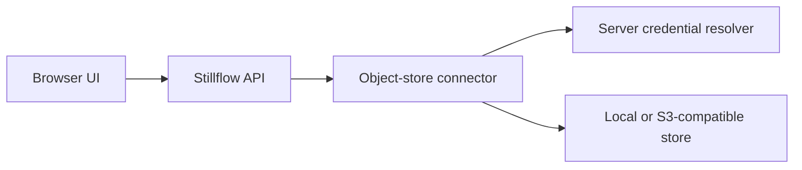

# Issue #8 implementation contract: range-aware object storage

Status: frozen for implementation  
Risk: `risk:high`  
Accepted base: `main@7aec0f910e260ac3bfe7e64f3bebf7061c76fb8c`  
Frozen: 2026-08-12

## 1. Objective

Implement one bounded byte-access adapter for capability-scoped local storage
and S3-compatible object storage, then expose supported remote tabular objects
through the existing `SourceConnector` contract.

The adapter provides `list`, `head`, `get_range`, `stream` and `upload`. Remote
CSV, TSV, JSON, NDJSON and Parquet objects support discovery, inspection,
preview and Arrow batch reads without exposing credentials, server paths or
provider errors. Preview must not download a complete large object when a
bounded range or Parquet metadata/range plan can satisfy the request.

## 2. Browser and trust boundary

Stillflow is currently a web application. The browser never receives S3 access
keys, session tokens, provider SDK objects, signed URLs or direct bucket access.
It calls the Stillflow API; the server resolves the connection's opaque
`CredentialRef`, performs object operations and returns sanitized domain data.



The connector crate is an infrastructure adapter. Neither `stillflow-core` nor
`stillflow-connectors` depends on it, and provider-specific types never enter
the domain model.

## 3. Accepted dependency and package boundary

- Add `stillflow-connector-object-store` to the backend workspace.
- Pin `object_store` to `=0.13.2` with `aws`, `fs` and `tokio`. This is the
  object-store release aligned with Arrow/Parquet 59 and Rust 1.85.
- Enable the Parquet 59 `object_store` feature only where required. Keep the
  workspace Arrow version singular and do not add the `arrow` meta-crate.
- Use `bytes`, `futures`, `async-trait`, `serde`, `tokio`, `tempfile` and the
  existing Stillflow crates. Do not add a second cloud SDK, HTTP client, CSV
  engine or expression engine.
- Reuse the local-tabular connector's format behavior through a narrow staged
  file facade. The object-store crate may depend on the local-tabular crate;
  the reverse dependency is forbidden. No staged-file type is added to core.
- The committed lockfile is part of the change and must pass Rust 1.85 and
  current stable CI.

References:

- https://github.com/apache/arrow-rs-object-store/tree/v0.13.2
- https://github.com/apache/arrow-rs/tree/59.1.0/parquet
- https://docs.rs/object_store/0.13.2/object_store/

## 4. Public adapter API

The crate exposes an object-safe server-side access contract with provider-
neutral response types:

```rust
pub trait ObjectStorageAccess: Send + Sync {
    async fn list(&self, prefix: &str, context: &RequestContext)
        -> ConnectorResult<Vec<ObjectInfo>>;
    async fn head(&self, key: &str, context: &RequestContext)
        -> ConnectorResult<ObjectInfo>;
    async fn get_range(&self, key: &str, range: Range<u64>, context: &RequestContext)
        -> ConnectorResult<Bytes>;
    async fn stream(&self, key: &str, context: &RequestContext)
        -> ConnectorResult<ObjectByteStream>;
    async fn upload(&self, key: &str, body: ObjectByteStream, context: &RequestContext)
        -> ConnectorResult<ObjectInfo>;
}
```

`ObjectInfo` contains only the normalized relative key, size, last-modified
time and opaque validator fields required for consistency. A byte stream yields
bounded `Bytes` chunks or a typed `ConnectorError`. The public adapter API does
not expose `object_store::Error`, provider URLs, headers or credentials.

`ObjectStoreConnector` implements `SourceConnector` for
`ConnectorKind::ObjectStore`. Its capabilities are schema discovery, preview,
streaming, column projection and range read. Filters, checkpoints, incremental
reads and change tracking return `UnsupportedCapability`.

## 5. Credential resolution

The connector receives an injected, object-safe `ObjectStoreCredentialResolver`.
Resolution takes the connection's validated `CredentialRef` and returns an
ephemeral S3 credential value containing access key, secret key and optional
session token. Credential values:

- are never `Serialize` or `Clone`;
- have a manual redacted `Debug` implementation;
- are consumed only while constructing the provider client;
- never enter errors, logs, events, assets or configuration;
- are cleared from temporary owned buffers on drop where practical.

The default resolver fails closed. Tests use an in-memory resolver. Anonymous
S3 access is an explicit non-secret configuration mode and does not consult the
resolver. Environment-chain and instance-metadata credential discovery are not
enabled implicitly.

## 6. Connection configuration

`SourceConnection.kind` must be `objectStore`. Configuration is tagged by
provider and rejects unknown fields.

Local example:

```json
{
  "provider": "local",
  "root": "/absolute/capability-root",
  "prefix": "incoming",
  "maxDiscoveredAssets": 10000,
  "maxObjectBytes": 1099511627776,
  "maxPreviewSourceBytes": 67108864,
  "requestTimeoutMs": 30000
}
```

S3-compatible example:

```json
{
  "provider": "s3",
  "bucket": "stillflow-ingestion",
  "region": "us-east-1",
  "endpoint": "https://objects.example.test",
  "prefix": "incoming",
  "pathStyle": true,
  "anonymous": false,
  "allowHttp": false,
  "maxDiscoveredAssets": 10000,
  "maxObjectBytes": 1099511627776,
  "maxPreviewSourceBytes": 67108864,
  "requestTimeoutMs": 30000
}
```

| Setting | Default | Accepted maximum |
| --- | ---: | ---: |
| discovered assets | 10,000 | 100,000 |
| object/read/upload bytes | 1 TiB | 1 TiB |
| source bytes fetched for text preview | 64 MiB | 64 MiB |
| list prefix length | 1,024 bytes | 1,024 bytes |
| object key length | 1,024 bytes | 1,024 bytes |
| request timeout | 30 seconds | 5 minutes |
| upload chunks | 1,000,000 | 1,000,000 |

Zero bounds and values above the maxima are invalid. `root` must be absolute.
Bucket, region and endpoint are non-secret identifiers. HTTPS is required for
remote endpoints by default; plain HTTP requires `allowHttp: true` and is
accepted only for loopback/private development fixtures. Configuration never
contains credentials or signed query strings.

## 7. Key, prefix and local-root safety

- Keys and prefixes are UTF-8 object keys normalized through
  `object_store::path::Path`.
- Reject empty keys, absolute paths, control characters, `.`/`..` components,
  backslash traversal, encoded traversal and query/fragment material.
- A configured prefix is prepended exactly once and cannot be escaped by an
  asset locator or low-level operation.
- Local access is rooted in the configured capability directory. Opening an
  object performs component-by-component no-follow validation before handing a
  normalized path to the local backend. Symlink and junction targets are not
  followed.
- Assets store only provider-relative keys. Absolute local roots, endpoints and
  bucket-internal implementation details are not returned to the browser.

## 8. Operation bounds, cancellation and consistency

Every operation validates `RequestContext` before provider work and at each
list page, stream chunk, range, staged-copy and multipart-upload boundary.
Provider futures are wrapped by the earlier of the request deadline and the
configured timeout. Cancellation returns `Cancelled`; deadline expiry returns
`Timeout`.

- `list` is lexicographically deterministic and stops at the configured asset
  count before allocating an unbounded result.
- `head` rejects objects above `maxObjectBytes` before reads.
- `get_range` requires `start < end`, checked integer conversion, a result no
  larger than `maxPreviewSourceBytes`, and an end not beyond object size.
- `stream` enforces the declared object size, cumulative byte count, per-chunk
  accounting and cancellation between chunks.
- `upload` uses multipart upload for streamed input, enforces cumulative bytes
  and chunk count, completes only after all input succeeds, and aborts on error,
  cancellation, timeout or early drop. A successful return is followed by
  `head` validation.
- Range-based reads retain and validate the initial ETag/version where the
  backend supplies one. A changed object fails as `InvalidData`; ranges from
  different versions are never combined silently.

No operation retries inside the adapter. Retryability is reported through the
typed error and remains an orchestration decision.

## 9. Discovery and stable identity

- Connector discovery lists the configured prefix and returns supported
  `.csv`, `.tsv`, `.json`, `.ndjson` and `.parquet` objects only, matched
  case-insensitively. Direct low-level `list` remains format-neutral.
- Empty directory-marker objects and objects above `maxObjectBytes` are skipped
  with bounded, sanitized findings where the calling operation supports them.
- Each asset is `AssetKind::File`; `locator.path` is the normalized key and
  `locator.container` is a stable non-secret provider label (`local` or the S3
  bucket name). Other locator fields are `None`.
- UUIDv5 input is connection ID, provider kind, normalized key and configured
  prefix. Object content, ETag and discovery timestamp do not change identity.
- Assets are ordered by normalized key. Duplicate keys are rejected, not
  silently overwritten.

## 10. Tabular inspect, preview and reads

Text formats reuse the local-tabular inference and decoding behavior through a
staged-file facade:

- inspection and preview fetch at most `maxPreviewSourceBytes` from the object
  head; the final partial CSV/TSV/NDJSON record is discarded deterministically;
  JSON array staging retains only complete top-level values;
- `rows_truncated`/`bytes_truncated` and a sanitized warning state when the
  source range was truncated;
- a full `read_batches` streams the object into a bounded temporary file, then
  uses the canonical local-tabular decoder; temporary files are deleted when
  the stream is dropped, including cancellation and decode failure;
- schema overrides, projection semantics, batch limits and Arrow envelopes
  remain identical to the local-tabular connector.

Parquet inspection, preview and read use
`parquet::arrow::async_reader::ParquetObjectReader` (or an equivalent bounded
`AsyncFileReader`) over `get_range`. Footer, metadata and selected column-chunk
ranges are read directly; Parquet is never staged or downloaded wholesale for
preview. Projection is pushed to the Parquet reader. Predicate pushdown remains
unsupported until its semantics are contracted separately.

Before any decode, `head` checks size and captures object validators. Empty,
unsupported, corrupt, changed or over-limit objects return typed sanitized
errors. Provider or decoder error text is retained only in internal diagnostic
chains after redaction and never copied to user-visible fields.

## 11. Error mapping and redaction

| Provider condition | Stillflow category | Retryable |
| --- | --- | --- |
| missing key/container | `NotFound` | no |
| unauthenticated | `Authentication` | no |
| permission denied | `Authorization` | no |
| invalid path/configuration | `InvalidConfiguration` | no |
| precondition/version changed/corrupt data | `InvalidData` | no |
| provider rate limit | `RateLimited` | yes |
| timeout | `Timeout` | yes |
| explicit cancellation | `Cancelled` | no |
| unsupported backend operation | `UnsupportedCapability` | no |
| transport/provider unavailable | `TransientSource` | yes |
| adapter invariant failure | `Internal` | no |

Public errors are stable phrases and may contain only operation type and a
normalized relative key when safe. They never contain credentials, signed
URLs, endpoint query strings, absolute roots, request headers, raw provider
messages or staged paths. Debug/display/serialization tests use sentinel secret
values and assert their absence from every public surface.

## 12. Required verification

Unit and integration tests must cover:

1. strict local/S3 configuration parsing and all numeric bounds;
2. credential resolver invocation, anonymous mode and redacted
   debug/error/serialization behavior;
3. prefix/key traversal, encoded traversal, symlink/junction escape and stable
   UUID behavior;
4. deterministic bounded list/head/get-range/stream/upload operations;
5. upload completion plus abort on source error, cancellation, timeout and
   byte/chunk overflow;
6. cancellation and deadlines before and during list, range, stream, staging,
   Parquet reads and upload;
7. local fixtures for every supported tabular format and malformed/empty/large
   inputs;
8. a loopback S3-compatible fixture exercised through the real
   `AmazonS3Builder`, including list, head, range GET, stream GET and multipart
   upload;
9. a counting object-store wrapper proving large CSV/NDJSON preview fetches no
   more than `maxPreviewSourceBytes` and never performs an unbounded GET;
10. a multi-row-group, multi-column Parquet fixture proving preview uses footer
    and column-chunk ranges and transfers materially less than the whole object;
11. range version-change detection, truncated text-record handling and staged
    temporary-file cleanup on normal completion and early drop;
12. inspect/preview/read schema consistency, projection, empty results, batch
    size one and existing envelope invariants;
13. exact error category/retryability mapping and sentinel-secret leakage
    checks across provider failure paths.

Repository checks are:

```text
cargo +1.85.0 fmt --all -- --check
cargo +1.85.0 clippy --workspace --all-targets --all-features -- -D warnings
cargo +1.85.0 test --workspace --all-features
cargo +stable fmt --all -- --check
cargo +stable clippy --workspace --all-targets --all-features -- -D warnings
cargo +stable test --workspace --all-features
npm run check
npm run test
```

## 13. Explicit non-goals

- Browser-side S3 SDKs, direct bucket access, signed-URL handoff or browser
  credential storage.
- Azure Blob, GCS, object version browsing, notifications or lifecycle policy.
- Remote workbook decoding; that requires a separately contracted composition
  of object access and the workbook connector.
- Predicate pushdown, incremental object checkpoints or automatic retries.
- Persisting credentials, provider clients, temporary object bytes or staging
  paths in core/storage snapshots.
- API routes and frontend connection screens; those are Issue #11 work after
  connector behavior is accepted.

## 14. Acceptance boundary

Issue #8 is complete only when local and S3-compatible byte operations share
one bounded interface, object-store tabular assets satisfy the canonical
connector lifecycle, remote previews are proven range-bounded, streamed uploads
abort safely, secrets are absent from public surfaces, and the full Rust 1.85,
stable and frontend validation matrix is green.
